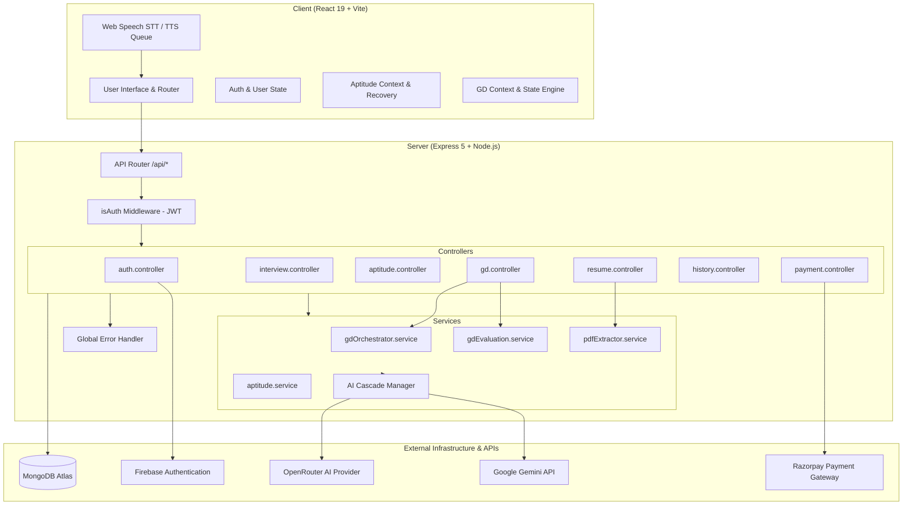

# Intellivora

> Comprehensive AI-Powered Career Preparation, Assessment, and Evaluation Platform

Intellivora is a full-stack MERN application engineered to simulate realistic recruitment workflows. It prepares candidates for high-stakes technical interviews, aptitude assessments, corporate group discussions, and applicant tracking systems (ATS) through automated evaluation, real-time speech interaction, and granular performance analytics.

---

## Table of Contents

- [Core Capabilities](#core-capabilities)
  - [1. AI Mock Technical Interviews](#1-ai-mock-technical-interviews)
  - [2. Timed Aptitude Assessments](#2-timed-aptitude-assessments)
  - [3. ATS Resume Analyzer](#3-ats-resume-analyzer)
  - [4. AI Group Discussion Simulator](#4-ai-group-discussion-simulator)
  - [5. Unified Activity & Assessment History](#5-unified-activity--assessment-history)
  - [6. Credit & Billing System](#6-credit--billing-system)
- [System Architecture](#system-architecture)
- [Technology Stack](#technology-stack)
- [Project Structure](#project-structure)
- [AI Orchestration & Provider Fallbacks](#ai-orchestration--provider-fallbacks)
- [Group Discussion (GD) Architecture](#group-discussion-gd-architecture)
- [Local Development Setup](#local-development-setup)
  - [Prerequisites](#prerequisites)
  - [Environment Configuration](#environment-configuration)
  - [Starting the Application](#starting-the-application)
- [Verification, Testing & Linting](#verification-testing--linting)
- [Security & Secret Hygiene](#security--secret-hygiene)

---

## Core Capabilities

### 1. AI Mock Technical Interviews
- **Role & Experience Customization**: Tailors questions to target job roles, years of experience, and resume technical stacks.
- **Dynamic Question Generation**: Structured difficulty scaling (Easy, Medium, Hard) across theoretical, architectural, and behavioral dimensions.
- **Interactive Chamber**: Live browser microphone input, synthesized conversational AI voice, timed question countdowns, and optional camera diagnostics.
- **Granular Evaluation Scorecards**: Detailed scoring across Confidence, Communication, and Technical Correctness, paired with actionable improvement advice and downloadable PDF reports.

### 2. Timed Aptitude Assessments
- **Curated Question Banks**: Quantitative Aptitude, Logical Reasoning, Verbal Ability, and Core Technical disciplines.
- **Authoritative Timer & Progression**: Server-synced countdown timers, question palette navigation, review flagging, and auto-submit triggers.
- **Session Recovery**: Local cache persistence (`recoverActiveTest`) prevents progress loss across browser refreshes.
- **Automated Grading & Verified Reports**: Instant scoring, accuracy breakdown, answer key analysis, and verifiable PDF performance certificates.

### 3. ATS Resume Analyzer
- **In-Memory PDF Extraction**: Extracts structured text and layout data from candidate PDF resumes securely on the server via PDF.js.
- **ATS Compatibility Scoring**: Benchmark matching against target roles and seniority levels with keyword gap identification.
- **Atomic Credit Safety**: Uses atomic database decrements (`findOneAndUpdate`) with automated compensating refunds in the event of an extraction or AI failure.

### 4. AI Group Discussion Simulator
- **Multi-Agent Deliberation**: Simulates a 5-participant corporate GD comprising the candidate, an impartial Central Orchestrator, and 3 distinct AI peers:
  - **Agent 1**: Analytical, empirical, data-driven perspective.
  - **Agent 2**: Pragmatic, strategic, implementation-focused perspective.
  - **Agent 3**: Creative, ethical, human-centric perspective.
- **Real-Time Voice Lifecycle**: Hands-free Web Speech API speech-to-text (STT) and coordinated multi-voice speech synthesis queue (TTS).
- **Floor-Share & Interruption Metering**: Tracks candidate speaking duration, floor-share percentages, and turn-taking balance.
- **4-Pillar Evaluation Scorecard**: Assesses candidate performance across:
  1. *Articulation & Clarity*
  2. *Leadership & Initiative*
  3. *Active Listening & Responsiveness*
  4. *Critical Thinking & Depth*
- **Placement Readiness Tiering**: Turn-by-turn critiques and placement readiness classification (Tier-1 Placement Ready down to Foundational Stage).

### 5. Unified Activity & Assessment History
- **Cross-Module Timeline**: Centralized chronological ledger tracking Mock Interviews, Aptitude Tests, and Group Discussions.
- **Fast Filtering & Search**: Filter by assessment category, search by topic keyword, or inspect completion status.
- **Deep-Linked Scorecards**: Direct navigation to detailed analytical breakdowns and historical reports.

### 6. Credit & Billing System
- **Transparent Ledger**: New users receive 100 registration credits upon account creation.
- **Predictable Consumption**:
  - Mock Interview: 100–250 credits (plan-dependent)
  - ATS Resume Analysis: 200 credits
  - Group Discussion: 150 credits
- **Payment Gateway**: Seamless Razorpay checkout with cryptographically verified HMAC signatures, replay protection, and idempotent fulfillment.

---

## System Architecture



---

## Technology Stack

### Frontend
- **Framework**: React 19, Vite
- **Styling**: Tailwind CSS v4, custom glassmorphism design system
- **State Management**: Redux Toolkit, React Context, custom reducers
- **Animation & UI**: Motion (Framer Motion v12), Lucide React, React Icons, Sonner
- **Data Visualization**: Recharts, React Circular Progressbar
- **Export & Documents**: jsPDF, jspdf-autotable
- **Audio & Media**: Web Speech API (`SpeechRecognition`, `SpeechSynthesis`), Web MediaStream API

### Backend
- **Runtime**: Node.js (ES Modules)
- **Framework**: Express 5
- **Database**: MongoDB with Mongoose 9
- **Authentication**: JWT (JSON Web Tokens) with HTTP-only cookies, Firebase Client Auth
- **AI Integrations**:
  - `@google/genai` (Google Gemini 2.5 Flash Lite)
  - OpenRouter API (Llama 3.3, Gemma 3, Nemotron, GPT-OSS)
- **File & PDF Processing**: Multer, PDF.js (`pdfjs-dist`)
- **Payments**: Razorpay Node SDK, Node Crypto (HMAC SHA-256)

---

## Project Structure

```
Intellivora/
├── client/                     # Frontend Single Page Application
│   ├── src/
│   │   ├── aptitude/           # Aptitude assessment pages, context, and data banks
│   │   ├── assets/             # Branding assets, UI icons, and demonstration media
│   │   ├── components/         # Reusable UI components (Navbar, Modals, Step wizards)
│   │   ├── gd/                 # Group Discussion module
│   │   │   ├── audio/          # Web Speech API hooks, audio profiles, speech queues
│   │   │   ├── context/        # GD session state reducer and provider
│   │   │   ├── pages/          # GDOverview, GDSetup, GDLobby, GDRoom, GDAnalysis
│   │   │   └── utils/          # GD topic banks, validators, formatting helpers
│   │   ├── pages/              # Primary routes (Home, Auth, Pricing, History, Resume)
│   │   ├── redux/              # Global user and session slices
│   │   ├── utils/              # Firebase client utilities
│   │   ├── App.jsx             # Top-level routing configuration
│   │   ├── index.css           # Global Tailwind v4 design tokens and utilities
│   │   └── main.jsx            # React root application bootstrap
│   ├── tests/                  # Client unit and integration test suite
│   ├── .env.example            # Client environment configuration template
│   └── package.json            # Client dependencies and scripts
│
├── server/                     # Backend REST API Server
│   ├── config/                 # Database connection and environment bootstrap
│   ├── controllers/            # Request handlers (auth, interview, aptitude, gd, payment)
│   ├── middlewares/            # JWT authorization, file upload, error handling
│   ├── models/                 # Mongoose schemas (User, Interview, GDSession, Payment)
│   ├── Routes/                 # Express route definitions
│   ├── services/               # AI orchestration, evaluation, PDF extraction, Razorpay
│   ├── tests/                  # Backend unit and integration test suite
│   ├── index.js                # Server entry point, middleware stack, route mounting
│   ├── .env.example            # Server environment configuration template
│   └── package.json            # Server dependencies and scripts
│
├── .gitignore                  # Global version control exclusions
└── README.md                   # Platform documentation
```

---

## AI Orchestration & Provider Fallbacks

Intellivora employs a resilient, multi-tiered AI architecture designed to minimize downtime and prevent user workflow interruptions:

1. **Primary Provider (OpenRouter Cascade)**: Requests default to high-throughput open-weight models (`llama-3.3-70b-instruct`, `gemma-3-27b-it`, `nemotron-3-super`, `gpt-oss-20b`). If a model experiences rate limits or cold-start latency, the cascade advances sequentially to the next model.
2. **Secondary Provider (Google Gemini)**: Used as an immediate high-speed fallback (`gemini-2.5-flash-lite`) via the official `@google/genai` SDK for low-latency completions.
3. **Defensive Normalization & Score Clamping**: AI outputs are extracted using boundary-aware substring parsing, numeric scores are strictly clamped within the $[0, 100]$ range, and fallback evaluations are synthesized if external models return unparseable JSON.

---

## Group Discussion (GD) Architecture

The GD simulator follows a state-machine lifecycle enforced by `GDSession` models and frontend audio managers:

- **Setup & Validation**: Users choose topic, category, difficulty, and duration. Checks verify credit balance ($\ge 150$) and user authentication.
- **Lobby Stage**: Pre-loads participant profiles, initializes Web Speech audio voices, and runs diagnostic microphone tests.
- **Live Room Coordination**:
  - Central Orchestrator initiates the opening prompt.
  - Peer agents deliberate dynamically using sliding context windows (pruned to the last 6 turns).
  - Candidate speech interrupts playing AI audio immediately and captures floor-share telemetry.
- **Evaluation & Refund Safeguards**:
  - If a session is aborted with 0 candidate turns, credits are fully refunded.
  - Completed sessions generate a multi-pillar scorecard and integrate seamlessly into Unified History.

---

## Local Development Setup

### Prerequisites
- **Node.js**: v18.0.0 or higher
- **npm**: v9.0.0 or higher
- **MongoDB**: Local instance or MongoDB Atlas cluster URI
- **Firebase Project**: Web project with Google Authentication enabled
- **AI Credentials**: OpenRouter API key and/or Google Gemini API key
- **Razorpay**: Test mode Key ID and Secret

### Environment Configuration

1. **Client Configuration**:
   ```bash
   cp client/.env.example client/.env
   ```
   Configure `client/.env` with your client endpoints and credentials:
   ```env
   VITE_SERVER_URL=http://localhost:8000
   VITE_FIREBASE_APIKEY=your_firebase_api_key
   VITE_FIREBASE_AUTH_DOMAIN=your-app.firebaseapp.com
   VITE_FIREBASE_PROJECT_ID=your-project-id
   VITE_FIREBASE_STORAGE_BUCKET=your-app.firebasestorage.app
   VITE_FIREBASE_MESSAGING_SENDER_ID=your_sender_id
   VITE_FIREBASE_APP_ID=1:1234567890:web:abcdef123456
   VITE_RAZORPAY_KEY_ID=rzp_test_your_key_id
   VITE_ALLOWED_EMAILS=user@example.com,admin@example.com
   ```

2. **Server Configuration**:
   ```bash
   cp server/.env.example server/.env
   ```
   Configure `server/.env` with your backend secrets:
   ```env
   PORT=8000
   NODE_ENV=development
   CLIENT_URL=http://localhost:5173
   MONGODB_URL=mongodb+srv://<username>:<password>@cluster.mongodb.net/intellivora?retryWrites=true&w=majority
   JWT_SECRET=your_jwt_secret_key_minimum_32_characters
   OPENROUTER_API_KEY=sk-or-v1-your-openrouter-api-key
   GEMINI_API_KEY=AIzaSyYourGeminiApiKey
   RAZORPAY_KEY_ID=rzp_test_your_key_id
   RAZORPAY_KEY_SECRET=your_razorpay_key_secret
   ```

### Starting the Application

1. **Install Dependencies**:
   ```bash
   cd server && npm install
   cd ../client && npm install
   ```

2. **Start Server**:
   ```bash
   cd server
   npm run dev
   ```
   *Server listens on `http://localhost:8000`*

3. **Start Client**:
   ```bash
   cd client
   npm run dev
   ```
   *Vite dev server starts on `http://localhost:5173`*

---

## Verification, Testing & Linting

Intellivora uses native Node.js test runners (`node --test`) for fast, zero-dependency unit and integration testing across frontend and backend modules.

| Target | Command | Description |
| :--- | :--- | :--- |
| **Server Tests** | `cd server && node --test tests/*.test.js` | Runs GD API, model validation, and orchestrator test suites |
| **Client Tests** | `cd client && node --test tests/*.test.js` | Runs GD foundation, lobby, room, setup, and history tests |
| **Client Lint** | `cd client && npm run lint` | Runs `oxlint` static code analysis |
| **Production Build** | `cd client && npm run build` | Compiles production assets via `vite build` |
| **Server Syntax** | `cd server && node --check index.js` | Validates server module syntax and imports |

---

## Security & Secret Hygiene

- **Zero Secrets Committed**: All private API keys, JWT secrets, and database credentials are strictly isolated in `.env` files ignored by git.
- **Safe Example Templates**: Both `client/.env.example` and `server/.env.example` provide comprehensive placeholder keys without exposing production secrets.
- **Timing-Safe HMAC Verification**: Razorpay payment verification uses `crypto.timingSafeEqual` to prevent side-channel timing attacks.
- **Automatic Temp File Disposal**: Uploaded resumes are temporarily processed on disk and guaranteed to be deleted via `fs.promises.unlink` within `finally` blocks.
- **Strict CORS Policy**: The server restricts allowed origins to explicit frontend URLs and rejects unauthorized cross-origin requests.

---

## License

This project is licensed under the ISC License.
