# Intellivora

> Autonomous Career Preparation, Recruitment Simulation, and Assessment Platform

[](https://react.dev/)
[](https://vite.dev/)
[](https://nodejs.org/)
[](https://expressjs.com/)
[](https://www.mongodb.com/)
[](https://tailwindcss.com/)
[](https://nodejs.org/)

Intellivora is a full-stack career preparation and recruitment simulation platform built on the MERN stack. It unifies essential hiring evaluation stages into a cohesive workflow: AI-driven mock technical interviews with speech interaction, timed multi-category aptitude assessments, ATS resume compatibility analysis, and multi-agent group discussions. Candidates receive automated evaluations, multi-pillar performance rubrics, and unified progress analytics to systematically prepare for modern recruitment funnels.

---

## Table of Contents

- [Overview](#overview)
- [Product Showcase](#product-showcase)
- [Core Features](#core-features)
  - [1. AI Mock Technical Interviews](#1-ai-mock-technical-interviews)
  - [2. Multi-Agent Group Discussion Simulator](#2-multi-agent-group-discussion-simulator)
  - [3. Timed Aptitude Assessments](#3-timed-aptitude-assessments)
  - [4. ATS Resume Intelligence](#4-ats-resume-intelligence)
  - [5. Progress & Learning Analytics](#5-progress--learning-analytics)
  - [6. Authentication & User Profile](#6-authentication--user-profile)
  - [7. Credit Economy & Billing](#7-credit-economy--billing)
  - [8. Administrative Operations](#8-administrative-operations)
  - [9. Role-Specific Preparation Tracks](#9-role-specific-preparation-tracks)
- [System Architecture](#system-architecture)
- [Technology Stack](#technology-stack)
- [Project Structure](#project-structure)
- [Getting Started](#getting-started)
  - [Prerequisites](#prerequisites)
  - [Environment Configuration](#environment-configuration)
  - [Running Locally](#running-locally)
- [Environment Variables](#environment-variables)
- [Testing & Quality Assurance](#testing--quality-assurance)
- [Code Quality & Security](#code-quality--security)
- [License](#license)

---

## Overview

Modern technical recruitment funnels are rigorous, multi-staged, and fragmented:

1. **Screening Gatekeepers**: Applicant tracking systems screen and rank resumes against target role benchmarks before recruiter review.
2. **Standardized Filtering**: Timed numerical, verbal, and logical aptitude tests eliminate candidates early in the pipeline.
3. **Behavioral & Leadership Trials**: Group discussions assess interpersonal communication, floor-share balance, and argument synthesis under pressure.
4. **Technical Panels**: Conversational technical interviews challenge domain knowledge, architectural reasoning, and communication cadence.

Candidates typically prepare across disparate websites, static question banks, and disconnected tools. **Intellivora unites the entire recruitment journey into a single platform.** Candidates experience continuous evaluation, unified historical analytics, authoritative credit management, and structured feedback across every stage of preparation.

---

## Product Showcase

### Product Overview
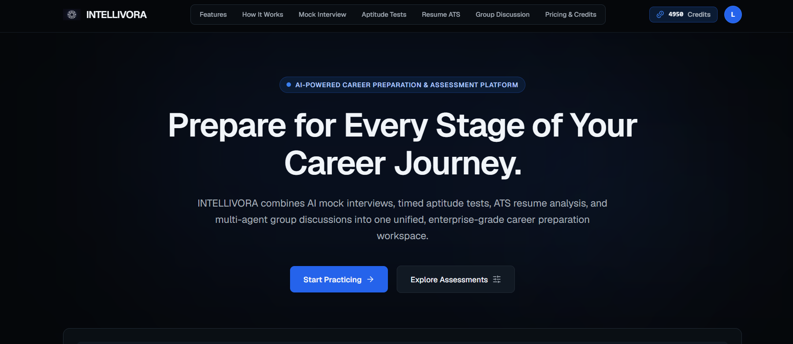
*Unified candidate workspace featuring dark telemetry aesthetic, multi-module overview cards, preparation methodology journey, and dual guest/user navigation.*

---

### AI Mock Interview

| Interview Chamber | Evaluation Scorecard |
| :---: | :---: |
| 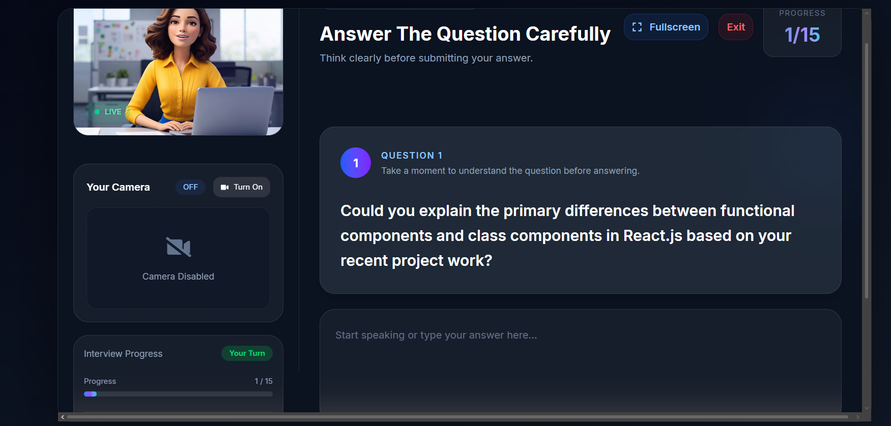 | 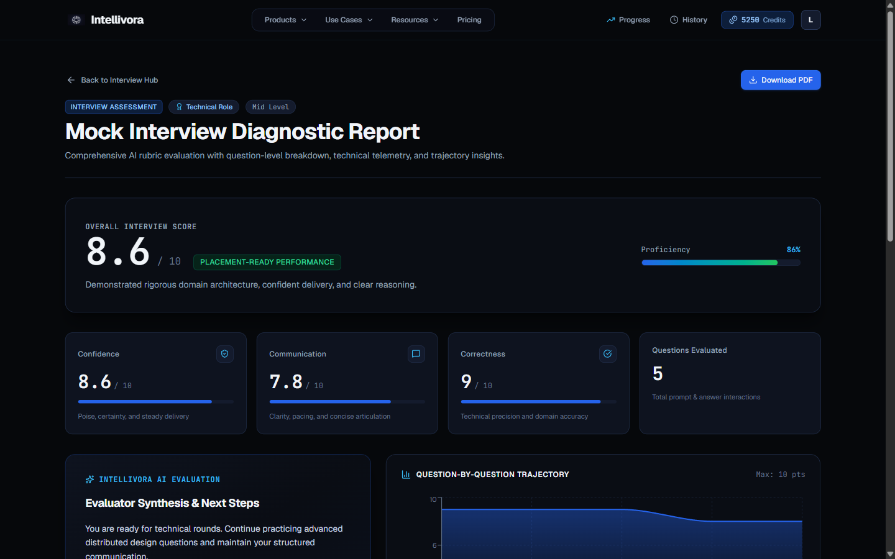 |
| *Conversational AI avatar, real-time speech-to-text transcription, speech synthesis audio, question timer, and dynamic prompt delivery.* | *Multi-dimensional rubric scoring (Confidence, Communication, Correctness), question-by-question score trajectory, and actionable evaluator feedback.* |

---

### Aptitude Diagnostic

| Timed Assessment Screen | Solution & Accuracy Review |
| :---: | :---: |
| 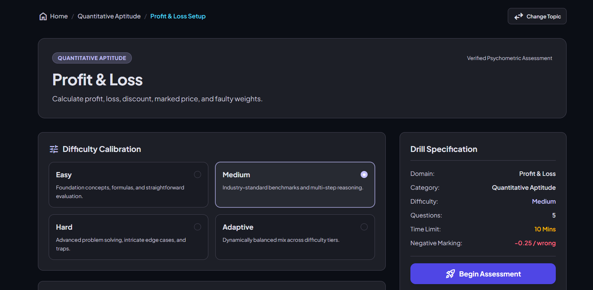 | 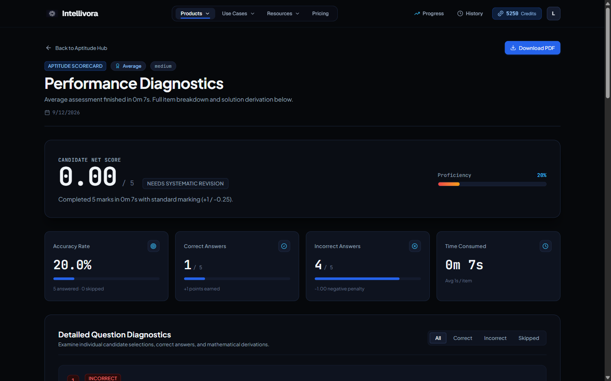 |
| *Standardized testing environment, multi-category question banks, persistent session recovery across browser refreshes, and countdown timer.* | *Post-test diagnostic breakdown, net candidate score, accuracy percentage, time tracking, and step-by-step mathematical derivations.* |

---

### Group Discussion Simulator

| Multi-Agent GD Chamber | 4-Pillar Debrief & Telemetry |
| :---: | :---: |
| 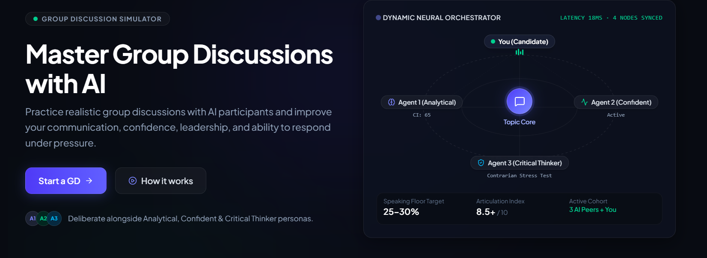 | 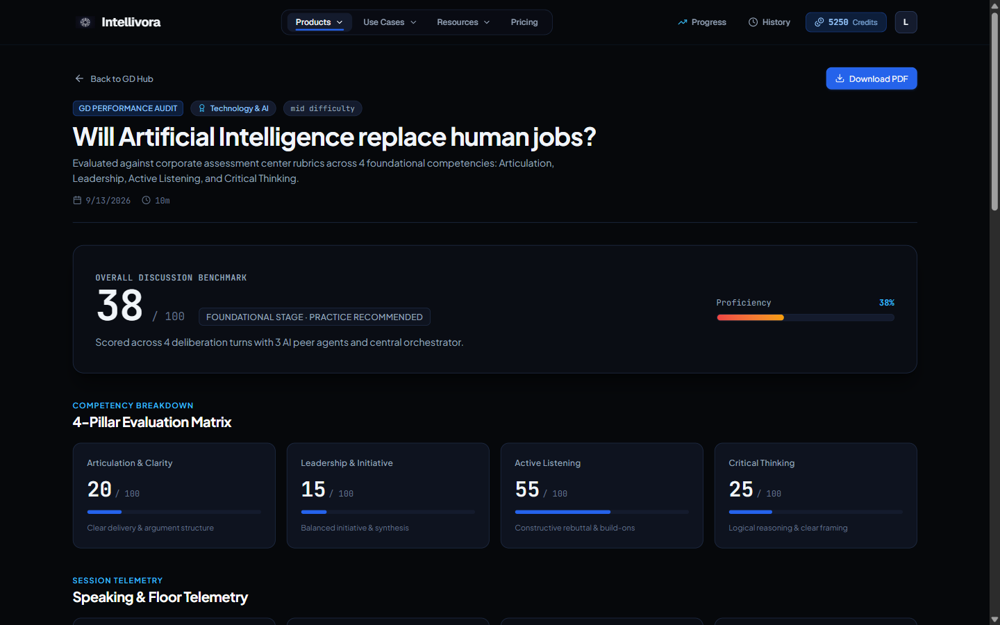 |
| *5-participant topology (Candidate, Central Orchestrator, 3 distinct AI peers), live floor-share telemetry metering, and speech interruption handling.* | *4-pillar competency matrix (Articulation, Leadership, Active Listening, Critical Thinking), floor-share metrics, and executive evaluator synthesis.* |

---

### Resume / ATS Compatibility
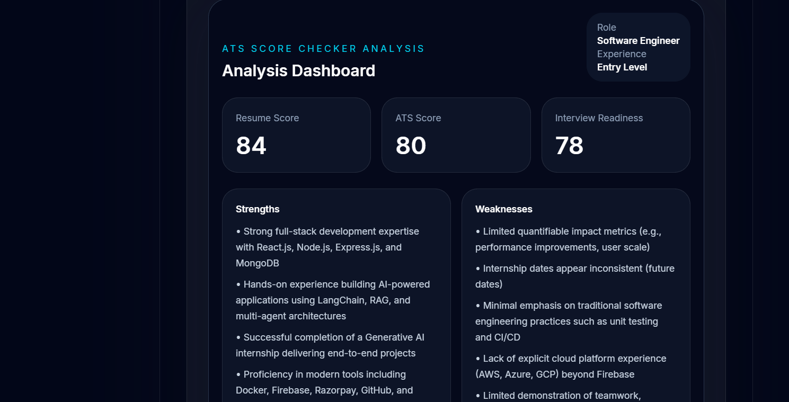
*In-memory PDF text extraction, role-calibrated ATS compatibility scoring, keyword gap identification, interview readiness score, and structured strengths/weaknesses breakdown.*

---

### Progress & Long-Term Analytics
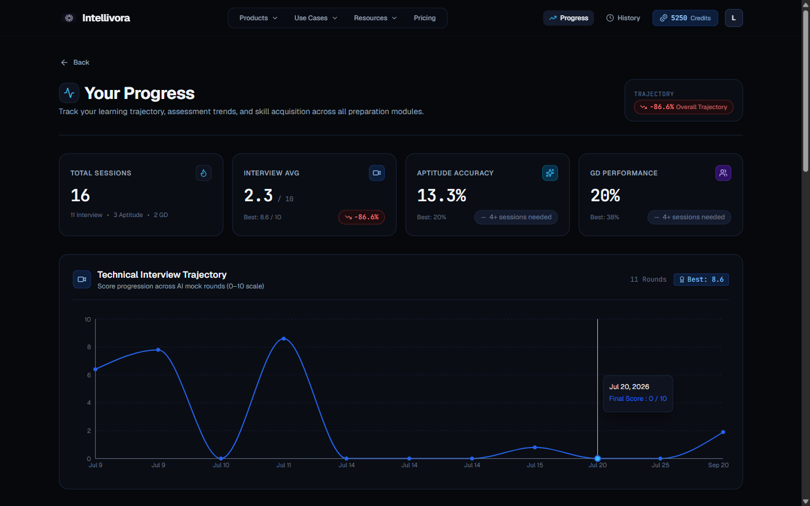
*Unified longitudinal tracking across all preparation modules, overall trajectory scoring, technical score curves, aptitude accuracy trends, and module distribution.*

---

### Administrative Operations
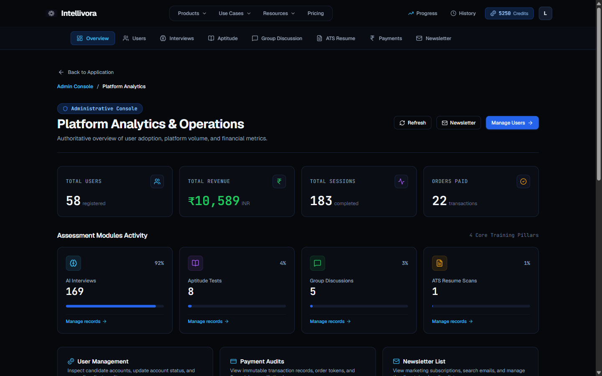
*Authoritative administrative console displaying platform-wide telemetry, user registration volumes, revenue reconciliation, module activity share, and user management directory.*

---

## Core Features

### 1. AI Mock Technical Interviews
- **Role & Experience Calibration**: Configurable parameters for target job roles (Frontend, Backend, Full Stack, DevOps, Distributed Systems) and experience brackets (Fresher, Intermediate, Senior).
- **Target Company Calibration**: Custom weighting calibrated to specific company profiles (e.g., Google, Amazon, Meta) prioritizing algorithms, system design, or behavioral competencies.
- **Dynamic Question Synthesis**: AI Gateway generates structured question tiers (theoretical fundamentals, practical problem-solving, architectural design) calibrated to resume skills.
- **Interactive Chamber**: Live browser microphone input via Web Speech API, synchronized AI voice avatar with video playback, real-time question timers, and optional camera diagnostics.
- **Answer Evaluation**: Instant LLM scoring on clarity, technical correctness, and communication structure.
- **Granular Evaluation Scorecards**: Immediate post-interview assessment evaluating Confidence, Communication Cadence, and Technical Correctness with actionable feedback and downloadable PDF reports.
- **Session Recovery**: Persistent session tracking via `sessionStorage` and backend endpoint `GET /api/interview/:id` prevents loss of active sessions during browser refreshes.

### 2. Multi-Agent Group Discussion Simulator
- **Multi-Agent Deliberation**: Simulates a 5-participant discussion chamber comprising the candidate, an impartial Central Orchestrator, and 3 distinct AI peers:
  - **Agent 1 (Analytical)**: Empirical, data-driven, statistical arguments.
  - **Agent 2 (Pragmatic)**: Practical, execution-oriented, implementation perspective.
  - **Agent 3 (Visionary & Ethical)**: Human-centric, societal impact, forward-looking perspective.
- **Real-Time Audio & Floor-Share Telemetry**: Hands-free Web Speech API input, priority-based interruption handling (candidate speech immediately suspends AI peers), and speaking floor-share metering.
- **4-Pillar Evaluation Rubric**: Scores candidate performance across:
  1. *Articulation & Clarity*
  2. *Leadership & Initiative*
  3. *Active Listening & Responsiveness*
  4. *Critical Thinking & Depth*
- **Refund Safeguard**: If a session is aborted with 0 candidate contributions, credits are automatically refunded to preserve user balance.

### 3. Timed Aptitude Assessments
- **Curated Category Banks**: Comprehensive assessment banks covering Quantitative Aptitude, Logical Reasoning, Verbal Ability, and Core Technical fundamentals.
- **Authoritative Timing & Navigation**: Server-synchronized countdown timer, question palette navigation with review flagging, and automatic submission triggers upon timer expiration.
- **Resilient State Persistence**: Local storage cache persistence (`recoverActiveTest`) prevents progress loss across accidental page reloads.
- **Step-by-Step Solution Review**: Question-by-question review displaying candidate selections, correct answers, negative marking penalties, and mathematical derivations.
- **Category Mastery Tracking**: Historical accuracy trends aggregated by sub-discipline (e.g., Percentages, Ratio & Proportion, Averages).

### 4. ATS Resume Intelligence
- **In-Memory PDF Extraction**: Extracts structured text from PDF resumes on the server without storing raw candidate document files in permanent storage.
- **Role-Calibrated Compatibility Scoring**: AI benchmark matching against candidate target roles, computing overall ATS score, resume readability, and interview readiness.
- **Keyword & Skill Gap Diagnostics**: Identifies missing core technologies, structural deficiencies, and concrete phrasing improvements.
- **Actionable Bullet Recommendations**: Sentence-by-sentence optimization suggestions to improve ATS parsing accuracy.

### 5. Progress & Learning Analytics
- **Unified Longitudinal Dashboard**: Aggregates performance data across all 4 training pillars (Interviews, Aptitude, Group Discussions, Resume Audits).
- **Trajectory Curves**: Chronological score progression graphs illustrating improvement over time.
- **Readiness Index**: Benchmark indicators estimating candidate readiness for live recruitment drives.
- **Target Company Alignment**: Real-time recalibration of performance scores based on the selected company target profile.

### 6. Authentication & User Profile
- **Dual-Layer Authentication**: Firebase client authentication (Email/Password and Google OAuth) synchronized with backend Mongoose `User` models via signed JWT cookies.
- **Session Management**: Secure HTTP-only cookies with SameSite protection and automatic session verification on application bootstrap.
- **Password Reset Flow**: Email-based credential recovery powered by Firebase Authentication.
- **User Profile Management**: Configurable candidate details including display name, target role, experience level, and target company preferences.

### 7. Credit Economy & Billing
- **Transparent Credit Accounting**:
  - **Welcome Bonus**: 100 introductory credits on registration.
  - **Mock Interviews**: 100 credits (Short), 150 credits (Standard), 250 credits (Full Assessment).
  - **ATS Resume Analysis**: 200 credits per complete audit.
  - **Group Discussion Simulator**: 150 credits per 10-minute session.
  - **Aptitude Assessments**: Free for registered candidates.
- **Server-Authoritative Pricing**:
  - **Pro**: ₹199 for 500 credits.
  - **Ultra**: ₹499 for 1,500 credits.
- **Cryptographic Payment Verification**: Razorpay payment orders generated on the backend with signature verification using HMAC SHA-256 via timing-safe comparison (`crypto.timingSafeEqual`).

### 8. Administrative Operations
- **Platform Telemetry Hub**: Overview of registered users, platform volume, completed sessions, and financial reconciliation.
- **User Moderation Directory**: Account status inspection, role management (candidate vs. admin), and manual credit adjustments.
- **Session Inspection**: Audit logs for interviews, aptitude attempts, GD deliberations, and payment histories.
- **Newsletter Subscription Manager**: Subscriber list inspection, search, and subscription status moderation.

### 9. Role-Specific Preparation Tracks
- Tailored curriculum landing pages and preparation advice for:
  - `/use-cases/software-engineers` (Data structures, algorithms, system design)
  - `/use-cases/data-analysts` (SQL, statistics, data visualization, business problem solving)
  - `/use-cases/product-business` (Product sense, metrics, stakeholder management)
  - `/use-cases/campus-placements` (Aptitude fundamentals, GD confidence, foundational tech)
  - `/use-cases/consultants` (Case interviews, structured communication, mental math)

---

## System Architecture

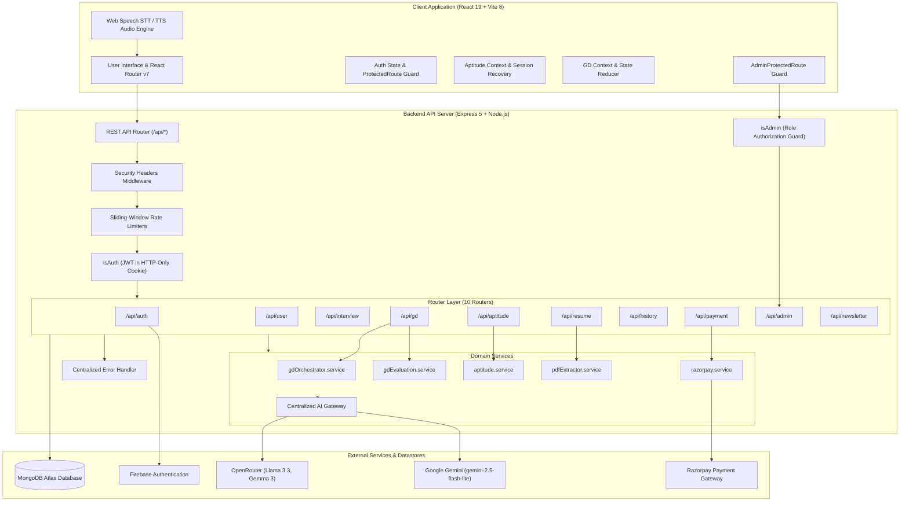

---

## Technology Stack

| Domain | Technology | Description |
| :--- | :--- | :--- |
| **Frontend Framework** | React 19, Vite 8 | Component rendering and fast HMR bundling |
| **Routing & Protection** | React Router v7 | Client routing with `ProtectedRoute` and `AdminProtectedRoute` |
| **Styling & Design** | Tailwind CSS v4 | Dark telemetry design system, responsive glassmorphism |
| **State Management** | Redux Toolkit, React Context | User session slice and module-level state reducers |
| **Animation & Feedback** | Motion (Framer Motion v12), Sonner | Interactive transitions, animated progress meters, toasts |
| **Data Visualization** | Recharts, Circular Progressbar | Radar charts, trajectory spline curves, skill meters |
| **Media & Audio** | Web Speech API, MediaStream API | SpeechSynthesis voice output, SpeechRecognition STT |
| **Document Processing** | jsPDF, jspdf-autotable, PDF.js | Client scorecard PDF generation and server PDF parsing |
| **Backend Framework** | Node.js (ESM), Express 5 | RESTful API service with modular routing |
| **Database & ODM** | MongoDB Atlas, Mongoose 9 | Document persistence, compound indexing, atomic operations |
| **Authentication** | JWT (HTTP-Only Cookie), Firebase | Dual-layer auth: Firebase client provider and secure JWT |
| **AI Orchestration** | `@google/genai`, OpenRouter API | Centralized AI Gateway with circuit breaker and fallbacks |
| **Billing & Payments** | Razorpay Node SDK, Node Crypto | Server-authoritative order creation and HMAC verification |
| **Testing & Quality** | `node:test`, `oxlint` | Zero-dependency native Node test runner and static linter |

---

## Project Structure

```
Intellivora/
├── client/                          # Frontend Single Page Application (Vite + React)
│   ├── src/
│   │   ├── admin/                   # Administrative module
│   │   │   ├── components/          # Admin navigation and table components
│   │   │   ├── pages/               # AdminDashboard, AdminUsers, AdminInterviews, etc.
│   │   │   └── adminApi.js          # Axios client for administrative endpoints
│   │   ├── aptitude/                # Aptitude module
│   │   │   ├── context/             # Aptitude state reducer and context provider
│   │   │   ├── data/                # Question bank repositories
│   │   │   ├── pages/               # AptitudeDashboard, TopicSelection, TestSetup, etc.
│   │   │   └── aptitudeApi.js       # Axios client for aptitude endpoints
│   │   ├── components/              # Shared components (Navbar, Footer, ProtectedRoute, etc.)
│   │   │   ├── layout/              # AppLayout shell and responsive containers
│   │   │   ├── results/             # ScoreSummary, MetricGrid, AIInsight, ResultActions
│   │   │   └── ui/                  # Button, Badge, Skeleton, ErrorState primitives
│   │   ├── config/                  # Configuration (pricingPlans, companyProfiles)
│   │   ├── gd/                      # AI Group Discussion module
│   │   │   ├── audio/               # Web Speech audio profiles, speech queue manager
│   │   │   ├── context/             # GD session state reducer and provider
│   │   │   └── pages/               # GDOverview, GDSetup, GDLobby, GDRoom, GDAnalysis
│   │   ├── pages/                   # Primary application routes
│   │   │   ├── home.jsx             # Candidate workspace landing page
│   │   │   ├── Auth.jsx             # Sign in, register, and password recovery
│   │   │   ├── InterviewPage.jsx    # 3-step interview coordinator with recovery
│   │   │   ├── InterviewReport.jsx  # Deep-linked interview evaluation report
│   │   │   ├── InterviewHistory.jsx # Unified activity ledger
│   │   │   ├── Progress.jsx         # Longitudinal analytics dashboard
│   │   │   ├── Pricing.jsx          # Credit purchase and Razorpay checkout
│   │   │   ├── Resume.jsx           # ATS resume upload and score inspection
│   │   │   ├── static/              # Privacy, Terms, Security, About, Careers, etc.
│   │   │   └── use-cases/           # Role-specific landing pages
│   │   ├── redux/                   # Redux Toolkit userSlice and global store
│   │   ├── utils/                   # PDF generators, progress API client, Firebase config
│   │   ├── App.jsx                  # Route definitions and session hydration
│   │   ├── index.css                # Tailwind utility layers and design tokens
│   │   └── main.jsx                 # React root bootstrap with Redux Provider
│   ├── tests/                       # Client test suite (103 tests)
│   ├── .env.example                 # Frontend environment template
│   └── package.json                 # Client dependencies and scripts
│
├── server/                          # Backend REST API Server (Express 5 + Node.js)
│   ├── config/                      # Database connection and company profiles
│   ├── controllers/                 # REST endpoint request controllers (10 controllers)
│   ├── middlewares/                 # Middleware (isAuth, isAdmin, rateLimiter, securityHeaders)
│   ├── models/                      # Mongoose data schemas (9 models)
│   ├── Routes/                      # Express route declarations (10 routers)
│   ├── services/                    # AI Gateway, GD orchestrator, PDF parser, Razorpay
│   ├── tests/                       # Server test suite (163 tests)
│   ├── index.js                     # Express bootstrap, CORS, middleware, and listen
│   ├── .env.example                 # Server environment template
│   └── package.json                 # Server dependencies and scripts
│
├── docs/                            # Documentation assets
│   └── screenshots/                 # 10 verified product screenshots
├── .gitignore                       # Git exclusions
└── README.md                        # Project documentation
```

---

## Getting Started

### Prerequisites
- **Node.js**: `v18.0.0` or higher (`node -v`)
- **npm**: `v9.0.0` or higher (`npm -v`)
- **MongoDB**: Local MongoDB instance or MongoDB Atlas cluster connection string
- **Google Gemini API Key**: Acquired via Google AI Studio
- **OpenRouter API Key**: (Optional but recommended for full AI fallback cascade)
- **Razorpay Account**: Test mode Key ID and Secret for payment simulation
- **Firebase Project**: Web app credentials for authentication

### Environment Configuration

1. **Configure Server Environment**:
   ```bash
   cp server/.env.example server/.env
   ```
   Edit `server/.env`:
   ```env
   PORT=8000
   NODE_ENV=development
   CLIENT_URL=http://localhost:5173
   MONGODB_URL=your_mongodb_connection_string
   JWT_SECRET=your_jwt_secret_key_minimum_32_characters
   OPENROUTER_API_KEY=your_openrouter_api_key
   GEMINI_API_KEY=your_gemini_api_key
   RAZORPAY_KEY_ID=rzp_test_your_key_id
   RAZORPAY_KEY_SECRET=your_razorpay_key_secret
   RAZORPAY_WEBHOOK_SECRET=your_razorpay_webhook_secret
   ADMIN_EMAIL=admin@example.com
   FIREBASE_PROJECT_ID=your-firebase-project-id
   ```

2. **Configure Client Environment**:
   ```bash
   cp client/.env.example client/.env
   ```
   Edit `client/.env`:
   ```env
   VITE_SERVER_URL=http://localhost:8000
   VITE_FIREBASE_APIKEY=your_firebase_api_key
   VITE_FIREBASE_AUTH_DOMAIN=your-app.firebaseapp.com
   VITE_FIREBASE_PROJECT_ID=your-firebase-project-id
   VITE_FIREBASE_STORAGE_BUCKET=your-app.firebasestorage.app
   VITE_FIREBASE_MESSAGING_SENDER_ID=your_sender_id
   VITE_FIREBASE_APP_ID=your_firebase_app_id
   VITE_RAZORPAY_KEY_ID=rzp_test_your_key_id
   VITE_ADMIN_EMAIL=admin@example.com
   ```

### Running Locally

1. **Install Dependencies**:
   ```bash
   # Install server dependencies
   cd server && npm install

   # Install client dependencies
   cd ../client && npm install
   ```

2. **Launch Backend Service**:
   ```bash
   cd server
   npm run dev
   ```
   *Express server starts listening on `http://localhost:8000`*

3. **Launch Frontend Service**:
   ```bash
   cd client
   npm run dev
   ```
   *Vite development server starts on `http://localhost:5173`*

---

## Environment Variables

### Backend (`server/.env`)

| Variable | Purpose | Required |
| :--- | :--- | :---: |
| `PORT` | Port number on which Express listens (default: 8000) | No |
| `NODE_ENV` | Runtime environment (`development` or `production`) | Yes |
| `CLIENT_URL` | Allowed client origin for CORS credentials | Yes |
| `MONGODB_URL` | MongoDB connection URI string | Yes |
| `JWT_SECRET` | Secret key for signing and verifying session JWTs | Yes |
| `OPENROUTER_API_KEY` | API key for OpenRouter AI models | Optional |
| `GEMINI_API_KEY` | API key for Google Gemini completion models | Yes |
| `RAZORPAY_KEY_ID` | Razorpay public key ID for payment creation | Yes |
| `RAZORPAY_KEY_SECRET` | Razorpay secret key for signature verification | Yes |
| `RAZORPAY_WEBHOOK_SECRET` | Secret for verifying incoming Razorpay webhooks | Optional |
| `ADMIN_EMAIL` | Email address authorized for `/admin` access | Yes |
| `FIREBASE_PROJECT_ID` | Firebase Project ID for token audience validation | Optional |

### Frontend (`client/.env`)

| Variable | Purpose | Required |
| :--- | :--- | :---: |
| `VITE_SERVER_URL` | Base URL of the backend Express API | Yes |
| `VITE_FIREBASE_APIKEY` | Firebase Web API key | Yes |
| `VITE_FIREBASE_AUTH_DOMAIN` | Firebase Authentication domain | Yes |
| `VITE_FIREBASE_PROJECT_ID` | Firebase project identifier | Yes |
| `VITE_FIREBASE_STORAGE_BUCKET` | Firebase storage bucket domain | Yes |
| `VITE_FIREBASE_MESSAGING_SENDER_ID` | Firebase Cloud Messaging sender ID | Yes |
| `VITE_FIREBASE_APP_ID` | Firebase Web application identifier | Yes |
| `VITE_RAZORPAY_KEY_ID` | Razorpay key ID for client checkout initialization | Yes |
| `VITE_ADMIN_EMAIL` | Controls UI visibility of the administrative console | Yes |

---

## Testing & Quality Assurance

Intellivora employs the Node.js native test runner (`node:test`) for zero-dependency test execution across both backend and frontend layers.

```bash
# Run client test suite (103 tests)
cd client && node --test tests/*.test.js

# Run client linter (0 errors)
cd client && npm run lint

# Run client production build verification
cd client && npm run build

# Run server test suite (163 tests)
cd server && node --test tests/*.test.js

# Verify server syntax across all files
cd server && node -c index.js
```

### Verified Test Suite Breakdown

```
================================================================================
TEST EXECUTION SUMMARY
================================================================================
Client Test Suites:  39 passed (103 tests, 0 failures)
Server Test Suites:  55 passed (163 tests, 0 failures)
--------------------------------------------------------------------------------
TOTAL AUTOMATED TESTS: 266 PASSED / 266 TOTAL (100% PASS RATE)
================================================================================
```

- **Client Tests (103 tests)**:
  - Navigation, route matching, auth hydration, and `ProtectedRoute` behavior
  - GD audio profiles, participant topology, and floor-share calculations
  - Form validation, error normalization, and state reducer lifecycles
  - Target company profiles, question preview models, and progress dashboard metrics
- **Server Tests (163 tests)**:
  - AI Gateway error categorization, circuit breaker, and cascade fallbacks
  - GD session creation, turn submission, and credit refund logic
  - Multi-agent speaker selection algorithm and pacing controls
  - Mongoose schema constraints for `User`, `Interview`, `GDSession`, `ResumeAnalysis`, `AptitudeAttempt`, `Payment`, and `NewsletterSubscriber`
  - PDF header magic byte verification, sliding-window rate limiters, and error sanitization
  - Admin metrics aggregation, user moderation, and newsletter deduplication

---

## Code Quality & Security

- **HTTP-Only Cookie Sessions**: Authentication tokens (JWT) are issued with `HttpOnly`, `SameSite=Strict` (or `Lax` in development), and `Secure` attributes, safeguarding sessions against Cross-Site Scripting (XSS) extraction.
- **Client UX Protection vs. Backend Authorization**: Frontend `<ProtectedRoute />` and `<AdminProtectedRoute />` handle UX redirection. The backend `isAuth` and `isAdmin` middlewares act as the authoritative security boundaries, validating tokens and roles independently on every request.
- **Sliding-Window Rate Limiting**: All 10 backend routers are protected by in-house sliding-window rate limiters with specific burst capacities (e.g., auth: 20 req/15 min; AI operations: 60 req/15 min; newsletter: 5 req/hour).
- **CodeQL Vulnerability Remediation**: Remediated 45 security findings identified during automated CodeQL audits:
  - Strict type casting and input validation to prevent NoSQL injection
  - Safe object handling to prevent prototype pollution
  - Controlled hashed filenames to prevent path traversal
  - Log sanitization to prevent log injection
  - Linear-time regular expressions to prevent ReDoS
- **Data Minimization on Resumes**: Candidate PDF resumes are processed in-memory on the server. Only structured analytical summaries (ATS score, keyword matches, improvements) are persisted. Raw resume files and unparsed text are not permanently retained.
- **Timing-Safe Cryptographic Billing**: Razorpay signatures are verified using HMAC SHA-256 with timing-safe comparison via `crypto.timingSafeEqual` to prevent timing discrepancy attacks.
- **Automated File Cleanup**: Uploaded files are processed within managed lifecycles with cleanup performed in `finally` blocks to remove temporary files across success and failure paths.
- **CORS Allowlist**: Cross-Origin Resource Sharing is restricted to explicit origin allowlists (`http://localhost:5173`, `http://localhost:5174`, and configured `CLIENT_URL`).

---

## License

This project is licensed under the [ISC License](LICENSE).
