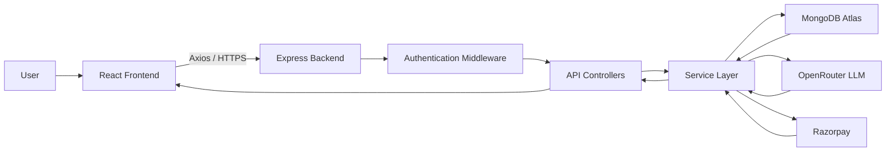
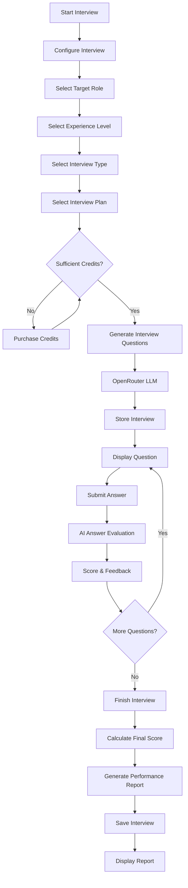
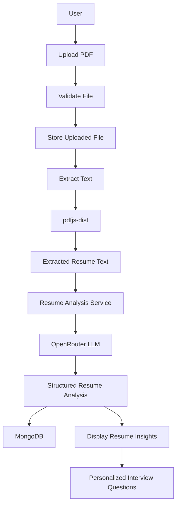
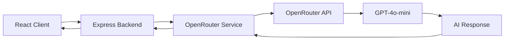
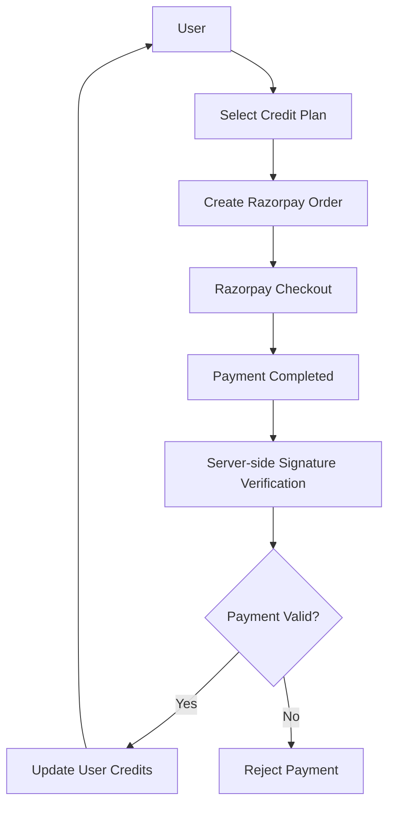

# INTELLIVORA — AI Interview Simulator

> An AI-powered interview preparation platform that analyzes resumes, generates personalized interview questions, evaluates candidate responses, and provides detailed performance insights.

INTELLIVORA is a full-stack web application designed to simulate technical and HR interview experiences using Generative AI.

It combines **resume analysis, personalized question generation, AI-based answer evaluation, interview scoring, interview history, and credit-based payments** into a single platform.

---

## Overview

INTELLIVORA provides an end-to-end interview preparation workflow:

```text
Resume Upload
     ↓
Resume Analysis
     ↓
Interview Configuration
     ↓
AI Question Generation
     ↓
Answer Submission
     ↓
AI Evaluation
     ↓
Performance Scoring
     ↓
Detailed Interview Report
```

Users can configure an interview according to their **target role, experience level, interview type, and selected plan**, practice answering AI-generated questions, and receive feedback on their performance.

---

## Key Features

### Resume Analysis

- PDF resume upload with validation
- Server-side PDF text extraction
- AI-powered resume analysis
- Resume score and ATS score
- Interview-readiness score
- Strengths and weaknesses
- Missing skills identification
- Personalized improvement suggestions
- Resume-based interview question generation

### AI Interview Simulator

- Interview configuration based on:
  - Target role
  - Experience level
  - Interview type
  - Interview plan
- AI-generated interview questions
- Interactive question-and-answer workflow
- AI-based answer evaluation
- Per-question scoring and feedback
- Final interview score
- Detailed performance report

### Interview History

- View previous interviews
- Access individual interview reports
- Store interview questions, answers, evaluations, and scores

### Credit System

AI-intensive operations use a credit-based system.

Credits are consumed for operations such as:

- Resume analysis
- Interview question generation
- Answer evaluation

### Razorpay Payments

- Credit purchase through Razorpay
- Server-side order creation
- Payment signature verification
- Credit balance update after successful verification

### Authentication & Security

- Google authentication using Firebase
- JWT-based backend authentication
- JWT stored in an `httpOnly` cookie
- Protected API routes
- CORS origin whitelist
- Server-side validation
- PDF file-type validation
- File-size restrictions
- Environment-based secret management

---

# System Architecture

INTELLIVORA follows a client-server architecture with a dedicated service layer for external integrations and business logic.



### Request Flow

```text
React Frontend
      ↓
Axios Request
      ↓
Express Route
      ↓
Authentication Middleware
      ↓
Controller
      ↓
Service Layer
      ↓
MongoDB / OpenRouter / Razorpay
      ↓
API Response
      ↓
React Frontend
```

---

# Interview Flow

The interview module is the core functionality of INTELLIVORA.

The workflow starts with interview configuration, checks credit availability, generates questions using the LLM, evaluates each answer, and finally produces a performance report.



### Interview Process

1. User configures the interview.
2. Backend validates the request and available credits.
3. Interview questions are generated through OpenRouter.
4. Generated questions are stored with the interview.
5. User answers each question.
6. Each answer is sent to the backend for AI evaluation.
7. The evaluation produces scores and feedback.
8. The process continues until all questions are completed.
9. The backend calculates the final interview score.
10. The completed interview and evaluation data are available through the report and history APIs.

---

# Resume Analysis Flow

The resume module processes the uploaded PDF on the backend before sending the extracted information to the AI service.



### Resume Analysis Output

The AI analysis can provide:

- Resume score
- ATS score
- Interview-readiness score
- Strengths
- Weaknesses
- Missing skills
- Improvement suggestions
- Personalized interview questions

The current implementation uses a structured AI response so that the frontend can consume the analysis consistently.

---

# AI Architecture

OpenRouter is used as the AI gateway for the application's Generative AI functionality.

**Model:** `openai/gpt-4o-mini`

AI requests are handled by the backend through a dedicated service layer.



### AI Use Cases

#### 1. Resume Analysis

The LLM analyzes extracted resume text and generates structured insights about the candidate's:

- Skills
- Experience
- Projects
- Strengths
- Weaknesses
- Missing skills
- ATS compatibility
- Interview readiness

#### 2. Interview Question Generation

Questions are generated according to the interview configuration, including:

- Target role
- Experience level
- Interview type
- Selected plan
- Relevant resume information

#### 3. Answer Evaluation

Candidate answers are evaluated for:

- Correctness
- Confidence
- Communication
- Overall response quality
- Feedback
- Areas for improvement

---

# Payment & Credit Flow

INTELLIVORA uses Razorpay for purchasing additional credits.



### Payment Process

1. User selects a credit plan.
2. Backend creates a Razorpay order.
3. Razorpay Checkout handles the payment.
4. Payment details are returned to the application.
5. Backend verifies the Razorpay signature.
6. Credits are updated only after successful verification.

---

# Tech Stack

## Frontend

- **React 18**
- **Vite**
- **Tailwind CSS**
- **React Router DOM**
- **Redux Toolkit**
- **Axios**
- **React Icons**

## Backend

- **Node.js**
- **Express 5**
- **MongoDB Atlas**
- **Mongoose**
- **Firebase Authentication**
- **JWT**
- **Multer**
- **pdfjs-dist**
- **Axios**
- **dotenv**
- **cookie-parser**
- **CORS**

## AI

- **OpenRouter**
- **OpenAI GPT-4o-mini**

## Payments

- **Razorpay**

---

# Backend Architecture

The backend follows a modular structure separating routing, controllers, services, models, and middleware.

```text
server/
│
├── controllers/
│   ├── auth.controller.js
│   ├── user.controller.js
│   ├── resume.controller.js
│   ├── interview.controller.js
│   └── payment.controller.js
│
├── models/
│   ├── user.model.js
│   ├── interview.model.js
│   └── payment.model.js
│
├── Routes/
│   ├── auth.route.js
│   ├── user.route.js
│   ├── resume.route.js
│   ├── interview.route.js
│   └── payment.route.js
│
├── services/
│   ├── openRouter.service.js
│   ├── resume.service.js
│   ├── resumeAnalysis.service.js
│   ├── pdfExtractor.service.js
│   └── razorpay.service.js
│
├── middlewares/
│   ├── auth.middleware.js
│   ├── uploadResume.js
│   └── errorHandler.js
│
├── Config/
│   └── db.js
│
└── index.js
```

> Folder names in the diagram should match the actual repository casing.

---

# Frontend Architecture

```text
client/
│
└── src/
    │
    ├── components/
    │   ├── Navbar
    │   ├── ResumeUploader
    │   └── ...
    │
    ├── pages/
    │   ├── Home
    │   ├── Auth
    │   ├── Resume
    │   ├── Interview
    │   ├── Report
    │   ├── History
    │   ├── Pricing
    │   └── ...
    │
    ├── redux/
    │   └── userSlice
    │
    ├── utils/
    │
    ├── App.jsx
    └── main.jsx
```

---

# Database Design

INTELLIVORA uses **MongoDB Atlas** with Mongoose for persistent application data.

### Users

Stores user-related information such as:

- User identity
- Authentication information
- Credit balance
- User-specific data

### Interviews

Stores:

- Interview configuration
- Generated questions
- Candidate answers
- AI evaluations
- Question-level scores
- Final score
- Report information

### Payments

Stores payment-related information associated with credit purchases.

---

# API Overview

| Module | Method | Endpoint | Purpose |
|---|---|---|---|
| Auth | POST | `/api/auth/google` | Authenticate user |
| Auth | POST | `/api/auth/logout` | Logout user |
| User | GET | `/api/user/current-user` | Get authenticated user |
| Resume | POST | `/api/resume/upload` | Upload PDF resume |
| Resume | POST | `/api/resume/extract` | Extract resume text |
| Resume | POST | `/api/resume/analyze` | Analyze resume using AI |
| Interview | POST | `/api/interview/generate` | Generate interview questions |
| Interview | POST | `/api/interview/answer` | Evaluate submitted answer |
| Interview | POST | `/api/interview/finish` | Complete interview |
| Interview | GET | `/api/interview/history` | Get interview history |
| Interview | GET | `/api/interview/report/:id` | Get interview report |
| Payment | POST | `/api/payment/create-order` | Create Razorpay order |
| Payment | POST | `/api/payment/verify` | Verify payment |

---

# Authentication Flow

INTELLIVORA uses Firebase Authentication for Google sign-in and JWT for backend authorization.


Protected backend routes verify the JWT before accessing user-specific resources.

---

# Security

The application implements security measures at both the frontend and backend levels.

### Authentication

- Firebase-based Google authentication
- JWT-based backend authorization
- `httpOnly` authentication cookie
- Protected API endpoints

### API Security

- CORS origin whitelist
- Server-side input validation
- User authorization checks
- Centralized error handling

### File Security

- PDF-only upload validation
- Maximum upload size of 5 MB
- Server-side file handling

### Payment Security

- Razorpay signature verification performed on the backend
- Secret credentials stored only in environment variables

### Secret Management

Sensitive credentials are stored through environment variables:

```text
MongoDB credentials
JWT secret
OpenRouter API key
Razorpay credentials
```

They should never be committed to the repository.

---

# Project Structure

```text
INTELLIVORA/
│
├── client/              # React frontend
│
├── server/              # Node.js + Express backend
│
└── README.md
```

---

# Getting Started

## Prerequisites

- Node.js 18+
- MongoDB Atlas
- Firebase project
- OpenRouter API key
- Razorpay account

## Clone Repository

```bash
git clone https://github.com/lucky5111397/Intellivora.git
cd Intellivora
```

## Backend Setup

```bash
cd server
npm install
npm run dev
```

Backend:

```text
http://localhost:8000
```

## Frontend Setup

Open another terminal:

```bash
cd client
npm install
npm run dev
```

Frontend:

```text
http://localhost:5173
```

---

# Environment Variables

Create a `.env` file inside the `server` directory.

```env
MONGODB_URL=your_mongodb_connection_string
JWT_SECRET=your_jwt_secret
OPENROUTER_API_KEY=your_openrouter_api_key
RAZORPAY_KEY_ID=your_razorpay_key_id
RAZORPAY_KEY_SECRET=your_razorpay_key_secret
CLIENT_URL=http://localhost:5173
PORT=8000
```

For the frontend:

```env
VITE_SERVER_URL=http://localhost:8000
```

> Do not commit `.env` files or API credentials to GitHub.

---

# Project Highlights

The project demonstrates practical implementation of:

- Full-stack React development
- REST API development with Express
- MongoDB data modeling with Mongoose
- JWT-based authentication
- Firebase Google authentication
- PDF processing
- Generative AI integration
- Prompt-based structured AI responses
- AI-powered interview evaluation
- Credit-based application logic
- Razorpay payment integration
- Server-side payment verification
- Protected API architecture

---

# Author

**Lucky Gupta**

B.Tech Student  
School of Management Sciences, Lucknow

**GitHub:** [lucky5111397](https://github.com/lucky5111397)

---
