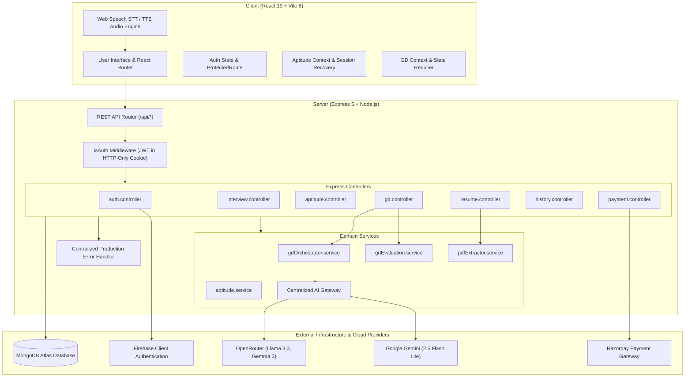
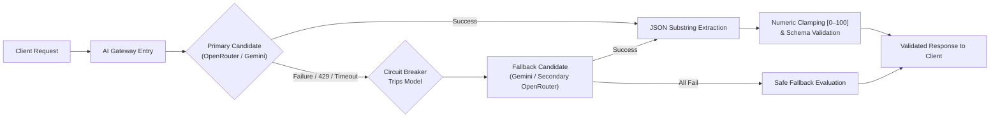

# Intellivora

> Comprehensive AI-Powered Career Preparation, Assessment, and Placement Simulation Platform

[](https://react.dev/)
[](https://vite.dev/)
[](https://nodejs.org/)
[](https://expressjs.com/)
[](https://www.mongodb.com/)
[](https://tailwindcss.com/)

Intellivora is a full-stack career preparation and recruitment simulation platform built on the MERN stack. It brings together four essential hiring evaluation stages into a cohesive workflow: AI-driven mock technical interviews, timed aptitude assessments, ATS resume compatibility analysis, and interactive multi-agent group discussions. Candidates receive automated evaluation, structured performance rubrics, and unified history tracking to systematically prepare for modern recruitment processes.

---

## Table of Contents

- [Why Intellivora?](#why-intellivora)
- [Product Showcase](#product-showcase)
- [Core Capabilities](#core-capabilities)
  - [1. AI Mock Technical Interviews](#1-ai-mock-technical-interviews)
  - [2. Timed Aptitude Assessments](#2-timed-aptitude-assessments)
  - [3. ATS Resume Analyzer](#3-ats-resume-analyzer)
  - [4. AI Group Discussion Simulator](#4-ai-group-discussion-simulator)
  - [5. Unified Activity & Assessment History](#5-unified-activity--assessment-history)
  - [6. Credit & Billing System](#6-credit--billing-system)
- [System Architecture](#system-architecture)
- [Technology Stack](#technology-stack)
- [Project Structure](#project-structure)
- [AI Orchestration & Resilience](#ai-orchestration--resilience)
- [Group Discussion Architecture](#group-discussion-architecture)
- [Security & Data Privacy](#security--data-privacy)
- [Local Development Setup](#local-development-setup)
  - [Prerequisites](#prerequisites)
  - [Environment Configuration](#environment-configuration)
  - [Running the Application](#running-the-application)
- [Testing & Quality Assurance](#testing--quality-assurance)
- [Future Roadmap](#future-roadmap)

---

## Why Intellivora?

Modern technical recruitment funnels are rigorous, multi-staged, and fragmented:

1. **Screening Gatekeepers**: Applicant tracking systems can automatically screen and rank resumes before recruiter review.
2. **Standardized Filtering**: Timed numerical, verbal, and logical aptitude tests eliminate candidates early in the pipeline.
3. **Behavioral & Leadership Trials**: Group discussions assess interpersonal communication, floor-share management, and argument synthesis under pressure.
4. **Technical Panels**: In-depth conversational technical interviews challenge domain knowledge, architectural reasoning, and communication cadence.

Candidates typically prepare across disparate websites, static question banks, and disconnected tools. **Intellivora unites the entire recruitment journey into a single cohesive platform.** Candidates experience continuous evaluation, unified historical analytics, authoritative credit management, and structured feedback across every stage of preparation.

---

## Product Showcase

| Module | Interface Preview | Primary Capabilities |
| :--- | :--- | :--- |
| **Unified Workspace** |  | Modern dark engineering aesthetic, active system telemetry, multi-module overview cards, preparation methodology journey, and dual guest/user navigation. |
| **AI Mock Interview** |  | Conversational female video avatar, SpeechSynthesis voice output, Web Speech API speech-to-text mic input, real-time countdown timer, and dynamic technical question rendering. |
| **Aptitude Chamber** |  | Standardized testing environment, multi-category question banks, persistent session recovery across browser refreshes, answer review palette, and authoritative countdown timer. |
| **Group Discussion** |  | 5-participant topology (Candidate, Central Orchestrator, 3 AI peers), live floor-share telemetry metering, speech interruption handling, and 4-pillar evaluation. |
| **ATS Resume Scorecard** |  | In-memory PDF text extraction, role-specific benchmark matching, keyword gap identification, interview readiness score, and structured strengths/weaknesses breakdown. |

---

## Core Capabilities

### 1. AI Mock Technical Interviews
- **Role & Experience Calibration**: Configurable parameters for target job roles (e.g., Frontend, Backend, Full Stack, DevOps, Distributed Systems) and experience brackets (Fresher, Intermediate, Senior).
- **Dynamic Question Synthesis**: AI Gateway generates structured question tiers (theoretical fundamentals, practical problem-solving, architectural design) calibrated to resume skills.
- **Interactive Chamber**: Live browser microphone input via Web Speech API, synchronized AI voice avatar with video playback, real-time question timers, and optional camera diagnostics.
- **Granular Evaluation Scorecards**: Immediate post-interview assessment evaluating Confidence, Communication Cadence, and Technical Correctness with actionable feedback and verifiable PDF generation.
- **Session Recovery**: Persistent session tracking via `sessionStorage` and backend endpoint `GET /api/interview/:id` prevents loss of active sessions during browser refreshes.

### 2. Timed Aptitude Assessments
- **Curated Category Banks**: Comprehensive assessment banks covering Quantitative Aptitude, Logical Reasoning, Verbal Ability, and Core Technical fundamentals.
- **Authoritative Timing & Navigation**: Server-synchronized countdown timer, question palette navigation with review flagging, and automatic submission triggers upon timer expiration.
- **Resilient State Persistence**: Local storage cache persistence (`recoverActiveTest`) prevents progress loss across accidental page reloads.
- **Instant Detailed Analytics**: Immediate scoring breakdown, category-specific accuracy rates, question-by-question answer review, and downloadable PDF performance certificates.

### 3. ATS Resume Analyzer
- **Privacy-Centric In-Memory PDF Extraction**: Extracts structured text and layout data from PDF resumes on the server using PDF.js without storing raw resume text in the database.
- **Role-Calibrated Compatibility Scoring**: AI benchmark matching against candidate target roles, computing overall ATS score, resume readability, and interview readiness.
- **Keyword & Skill Gap Diagnostics**: Identifies missing core technologies, structural deficiencies, and concrete phrasing improvements.
- **Atomic Credit Safety**: Executes credit deductions via atomic `$gte` checks with automated compensating refunds if extraction or AI analysis fails.

### 4. AI Group Discussion Simulator
- **Multi-Agent Deliberation**: Simulates a realistic 5-participant discussion chamber comprising the candidate, an impartial Central Orchestrator, and 3 distinct AI peers:
  - **Agent 1 (Analytical)**: Empirical, data-driven, statistical arguments.
  - **Agent 2 (Pragmatic)**: Practical, execution-oriented, implementation perspective.
  - **Agent 3 (Visionary & Ethical)**: Human-centric, societal impact, forward-looking perspective.
- **Real-Time Audio & Floor-Share Telemetry**: Hands-free Web Speech API input, priority-based interruption handling (candidate speech immediately suspends AI peers), and speaking floor-share metering.
- **4-Pillar Evaluation Rubric**: Scores candidate performance across:
  1. *Articulation & Clarity*
  2. *Leadership & Initiative*
  3. *Active Listening & Responsiveness*
  4. *Critical Thinking & Depth*
- **Refund Safeguard**: If a session is aborted with 0 candidate contributions, credits are automatically refunded to preserve user balance.

### 5. Unified Activity & Assessment History
- **Cross-Module Unified Ledger**: Centralized chronological timeline aggregating user activity across all 4 platform modules:
  - Mock Interviews (scores, roles, durations)
  - Aptitude Assessments (scores, accuracy, category)
  - Group Discussions (topic, floor share, 4-pillar scores)
  - ATS Resume Audits (ATS score, target role, readiness score)
- **Fast Filtering & Search**: Category-specific tab filters, free-text topic search, and chronological date sorting.
- **Deep-Linked Reports & User Isolation**: Direct navigation back into detailed analytical reports, with strict per-user database scoping for safe record deletion.

### 6. Credit & Billing System
- **Transparent Credit Economy**:
  - **New User Welcome Bonus**: 100 introductory credits credited on signup.
  - **Mock Interviews**: 100 credits (Short), 150 credits (Standard), 250 credits (Full Assessment).
  - **ATS Resume Analysis**: 200 credits per complete audit.
  - **Group Discussion Simulator**: 150 credits per 10-minute session.
  - **Aptitude Assessments**: Free for registered candidates.
- **Backend-Authoritative Pricing**:
  - **Starter Pack**: ₹199 for 500 credits.
  - **Pro Pack**: ₹499 for 1,500 credits.
- **Cryptographic Payment Verification**: Razorpay payment orders are generated on the backend, and payment signatures are verified using HMAC SHA-256 with timing-safe comparison via `crypto.timingSafeEqual`.

---

## System Architecture



---

## Technology Stack

| Domain | Technology | Purpose |
| :--- | :--- | :--- |
| **Frontend Framework** | React 19, Vite 8 | High-performance component rendering and fast HMR bundling |
| **Routing & Protection** | React Router v7 | Client-side routing with auth-hydrated `ProtectedRoute` guards |
| **Styling & Design** | Tailwind CSS v4 | Dark telemetry design system, responsive glassmorphism |
| **State Management** | Redux Toolkit, Context API | User authentication slice, module-level state reducers |
| **Animation & Feedback** | Motion (Framer Motion v12), Sonner | Smooth interactive transitions, animated counters, toast alerts |
| **Data Visualization** | Recharts, Circular Progressbar | Radar charts, performance trends, and skill breakdown meters |
| **Media & Audio** | Web Speech API, MediaStream API | SpeechSynthesis voice output, SpeechRecognition STT, webcam stream |
| **Document Processing** | jsPDF, jspdf-autotable, PDF.js | Client-side scorecard PDF generation and server-side PDF text parsing |
| **Backend Framework** | Node.js (ESM), Express 5 | RESTful API service with modular routing and structured middleware |
| **Database & ODM** | MongoDB Atlas, Mongoose 9 | Document persistence, compound indexing, atomic credit increments |
| **Authentication** | JWT (HTTP-Only Cookie), Firebase | Dual-layer auth: Firebase client provider and secure server-signed JWT |
| **AI Orchestration** | `@google/genai`, OpenRouter API | Centralized AI Gateway with circuit breaker, prompt cascades, and fallbacks |
| **Billing & Payments** | Razorpay Node SDK, Node Crypto | Server-authoritative order creation and timing-safe HMAC verification |
| **Quality & Testing** | `node:test`, `oxlint` | Zero-dependency native Node test runner and ultra-fast static linter |

---

## Project Structure

```
Intellivora/
├── client/                          # Frontend Single Page Application (Vite + React)
│   ├── src/
│   │   ├── aptitude/                # Aptitude module (screens, context, API client, questions)
│   │   │   ├── context/             # Aptitude state reducer and context provider
│   │   │   ├── data/                # Question bank repositories
│   │   │   ├── pages/               # Dashboard, TestSetup, TestScreen, AptitudeResult
│   │   │   └── aptitudeApi.js       # Axios client for aptitude endpoints
│   │   ├── assets/                  # Branding graphics, icons, and demonstration video media
│   │   │   └── videos/              # female-ai.mp4 (AI video avatar)
│   │   ├── components/              # Shared components (Navbar, Footer, ProtectedRoute, Modals)
│   │   │   ├── ProtectedRoute.jsx   # UX route guard with auth hydration holding state
│   │   │   ├── Step1SetUp.jsx       # Interview setup form and credit verification
│   │   │   ├── Step2Interview.jsx   # Voice AI interview room with video avatar
│   │   │   └── Step3Report.jsx      # Post-interview evaluation scorecard
│   │   ├── config/                  # Client-side configuration
│   │   │   └── pricingPlans.js      # Client-side pricing display/reference configuration
│   │   ├── gd/                      # AI Group Discussion module
│   │   │   ├── audio/               # Web Speech audio profiles, speech queue manager
│   │   │   ├── context/             # GD session state reducer and provider
│   │   │   ├── pages/               # GDOverview, GDSetup, GDLobby, GDRoom, GDAnalysis
│   │   │   └── utils/               # Topic banks, form validators, telemetry helpers
│   │   ├── pages/                   # Primary application routes
│   │   │   ├── home.jsx             # Stitch-matched dark telemetry landing page
│   │   │   ├── Auth.jsx             # Sign in and registration with post-login redirect
│   │   │   ├── InterviewPage.jsx    # 3-step interview coordinator with refresh recovery
│   │   │   ├── InterviewReport.jsx  # Direct deep-linked report view
│   │   │   ├── InterviewHistory.jsx # Unified 4-module activity ledger
│   │   │   ├── Pricing.jsx          # Credit purchase and Razorpay checkout
│   │   │   └── Resume.jsx           # ATS resume upload and score inspection
│   │   ├── redux/                   # Redux Toolkit userSlice and global store
│   │   ├── App.jsx                  # Route definitions and session hydration
│   │   ├── index.css                # Tailwind v4 utility layers and font tokens
│   │   └── main.jsx                 # React root bootstrap with Redux Provider
│   ├── tests/                       # Client behavioral and integration test suite
│   │   ├── gdAnalysis.test.js       # GD analysis and unified history tests
│   │   ├── gdAudio.test.js          # Audio profile and speech synthesis tests
│   │   ├── gdLobbyRoom.test.js      # GD lobby, live room, and floor-share tests
│   │   ├── gdSetup.test.js          # GD form validation and credit resolution tests
│   │   └── homeAndNavbar.test.js    # Navbar, routing, and billing contract tests
│   ├── .env.example                 # Frontend environment template
│   └── package.json                 # Client dependencies and build scripts
│
├── server/                          # Backend REST API Server (Express 5 + Node.js)
│   ├── config/                      # Database connection and credit rules
│   │   ├── db.js                    # Mongoose connection pool configuration
│   │   ├── credits.config.js        # Credit deduction values across modules
│   │   └── aptitudeSyllabus.js      # Categorical syllabus taxonomy
│   ├── controllers/                 # REST endpoint request controllers
│   │   ├── auth.controller.js       # Registration, login, cookie issuance, logout
│   │   ├── interview.controller.js  # Question generation, answer grading, finish
│   │   ├── aptitude.controller.js   # Tests, answer saving, timer submission
│   │   ├── gd.controller.js         # Session lifecycle, turn submission, evaluation
│   │   ├── history.controller.js    # Unified 4-module aggregation and delete
│   │   ├── resume.controller.js     # PDF extraction, ATS analysis, credit handling
│   │   └── payment.controller.js    # Razorpay order generation and verification
│   ├── middlewares/                 # Express middleware pipeline
│   │   ├── isAuth.js                # JWT validation via HTTP-only cookie
│   │   ├── multer.js                # Secure in-memory/disk file upload handler
│   │   ├── rateLimiter.js           # IP-based endpoint throttling
│   │   ├── securityHeaders.js       # Production security headers
│   │   └── errorHandler.js          # Sanitized production error handler
│   ├── models/                      # Mongoose data schemas
│   │   ├── user.model.js            # User profile, credentials, and credit balance
│   │   ├── interview.model.js       # Interview session, questions, and scores
│   │   ├── aptitudeAttempt.model.js # Aptitude test answers and calculated score
│   │   ├── gdSession.model.js       # GD transcript, floor-share, and 4 pillars
│   │   ├── resumeAnalysis.model.js  # Structured ATS evaluation results (minimized)
│   │   └── payment.model.js         # Payment records, order IDs, and status
│   ├── Routes/                      # Express route declarations
│   ├── services/                    # Domain logic and external provider services
│   │   ├── aiGateway.service.js     # Resilient AI gateway with health circuit breaker
│   │   ├── gdOrchestrator.service.js# Multi-agent speaker selection and deliberation
│   │   ├── gdEvaluation.service.js  # 4-pillar GD scoring and tier classification
│   │   ├── pdfExtractor.service.js  # PDF text parsing via PDF.js
│   │   ├── resumeAnalysis.service.js# ATS prompt generation and evaluation
│   │   └── razorpay.service.js      # Razorpay client instance
│   ├── tests/                       # Server unit and integration test suite
│   │   ├── aiGateway.test.js        # AI fallback chain and error categorization
│   │   ├── gdApi.test.js            # GD session lifecycle and credit tests
│   │   ├── gdOrchestrator.test.js   # Speaker selection and context window tests
│   │   ├── gdSession.model.test.js  # GDSession schema and index validation
│   │   ├── historyAndResume.test.js # ATS model and unified history tests
│   │   └── productionHardening.test.js # PDF magic bytes, rate limiter, and security
│   ├── index.js                     # Express bootstrap, CORS, middleware, and listen
│   ├── .env.example                 # Server environment template
│   └── package.json                 # Server dependencies and test scripts
│
├── .gitignore                       # Git exclusions (node_modules, .env, dist)
└── README.md                        # Project documentation
```

---

## AI Orchestration & Resilience

Intellivora implements a centralized **AI Gateway** (`server/services/aiGateway.service.js`) designed for resilient multi-model execution and automated fallback handling:



### Key Gateway Mechanisms
- **Dynamic Multi-Provider Cascade**:
  - Primary tier defaults to configured open-weight models via OpenRouter (`llama-3.3-70b-instruct`, `gemma-3-27b-it`, `nemotron-3-super`, `gpt-oss-20b`).
  - Secondary tier transitions immediately to Google Gemini (`gemini-2.5-flash-lite`) via `@google/genai` for low-latency completions.
- **Circuit Breaker & Health Tracking**: Tracks per-model latency, consecutive failure counts, and cooldown timers. When an upstream model returns 429 (Rate Limit) or 503 (Unavailable), it is temporarily isolated from the execution chain.
- **Defensive Parsing & Clamping**: Extracts JSON objects through boundary-aware substring matching to safely ignore markdown fences or leading AI commentary. All score outputs are clamped within the `0–100` range before reaching the database.
- **Compensating Refunds**: If all AI providers in the fallback cascade fail during a paid transaction (such as ATS resume analysis or GD generation), credits are automatically refunded to the candidate's account.

---

## Group Discussion Architecture

The AI Group Discussion Simulator models complex interpersonal communication dynamics through an event-driven turn-taking engine:

1. **Topological Initialization**: Sets up 5 active participant personas in the discussion room:
   - 1 Human Candidate
   - 1 Impartial Central Orchestrator (opening remarks, time warnings, session close)
   - 3 Heterogeneous AI Peers (Analytical, Pragmatic, Visionary)
2. **Context Window Pruning**: Maintains coherent conversational memory by sliding a pruned context window of the latest turns while preserving the foundational discussion thesis.
3. **Turn Arbitration Algorithm**: Evaluates participant speaking frequency and floor-share percentage to select the next AI speaker dynamically, preventing monopolization.
4. **Live Audio Interruption**: Utilizes Web Speech API state listeners. The moment candidate speech is detected, active AI peer audio playback is halted immediately, transferring the floor to the candidate.
5. **Telemetry & Scorecard Generation**: Computes total speaking time, speaking floor share, turn count, and evaluates articulation, leadership, listening, and critical thinking across a 4-pillar rubric.

---

## Security & Data Privacy

- **HTTP-Only Cookie Sessions**: Authentication tokens (JWT) are issued with `HttpOnly`, `SameSite=Strict`, and `Secure` attributes, safeguarding sessions against Cross-Site Scripting (XSS) extraction.
- **Client Route UX Protection vs. Backend Authorization**: Frontend `<ProtectedRoute />` handles UX redirection and preserves destination URLs via `state.from`. The backend `isAuth` middleware acts as the true security boundary, independently validating tokens on every protected request.
- **Strict Data Isolation**: History, interview reports, aptitude attempts, and GD records are strictly filtered by `{ userId: req.userId }`, preventing cross-tenant data leakage or unauthorized access.
- **Data Minimization on Resume Uploads**: Candidate PDF resumes are parsed in-memory on the server. Only structured analytical summaries (ATS score, keyword matches, improvements) are persisted to MongoDB. Full raw resume text is never retained in the database.
- **Timing-Safe Cryptographic Billing**: Razorpay signatures are verified using HMAC SHA-256 with timing-safe comparison via `crypto.timingSafeEqual` to prevent side-channel timing discrepancy attacks.
- **Automated File Cleanup**: Uploaded files are processed within managed disk/memory lifecycles, with cleanup performed in `finally` blocks to remove temporary files across success and failure paths.
- **CORS & Rate Limiting**: Production middleware explicitly whitelists trusted client origins and applies IP-based rate limiting to prevent brute-force attacks.

---

## Local Development Setup

### Prerequisites
- **Node.js**: `v18.0.0` or higher (`node -v`)
- **npm**: `v9.0.0` or higher (`npm -v`)
- **MongoDB**: Local MongoDB instance or MongoDB Atlas cluster connection string
- **Google Gemini API Key**: Acquired via Google AI Studio
- **OpenRouter API Key**: (Optional but recommended for full AI fallback cascade)
- **Razorpay Account**: Test mode Key ID and Secret for payment simulation

### Environment Configuration

1. **Configure Server Environment**:
   ```bash
   cp server/.env.example server/.env
   ```
   Edit `server/.env`:
   ```env
   PORT=8000
   NODE_ENV=development
   CLIENT_URL=http://localhost:5173
   MONGODB_URL=your_mongodb_connection_string
   JWT_SECRET=your_jwt_secret_key_minimum_32_characters
   GEMINI_API_KEY=your_gemini_api_key
   OPENROUTER_API_KEY=your_openrouter_api_key
   RAZORPAY_KEY_ID=rzp_test_your_key_id
   RAZORPAY_KEY_SECRET=your_razorpay_key_secret
   ```

2. **Configure Client Environment**:
   ```bash
   cp client/.env.example client/.env
   ```
   Edit `client/.env`:
   ```env
   VITE_SERVER_URL=http://localhost:8000
   VITE_FIREBASE_APIKEY=your_firebase_api_key
   VITE_FIREBASE_AUTH_DOMAIN=your-app.firebaseapp.com
   VITE_FIREBASE_PROJECT_ID=your-project-id
   VITE_FIREBASE_STORAGE_BUCKET=your-app.firebasestorage.app
   VITE_FIREBASE_MESSAGING_SENDER_ID=your_sender_id
   VITE_FIREBASE_APP_ID=your_firebase_app_id
   VITE_RAZORPAY_KEY_ID=rzp_test_your_key_id
   ```

### Running the Application

1. **Install Dependencies**:
   ```bash
   # Install server dependencies
   cd server && npm install

   # Install client dependencies
   cd ../client && npm install
   ```

2. **Launch Backend Service**:
   ```bash
   cd server
   npm run dev
   ```
   *Express server starts listening on `http://localhost:8000`*

3. **Launch Frontend Service**:
   ```bash
   cd client
   npm run dev
   ```
   *Vite development server starts on `http://localhost:5173`*

---

## Testing & Quality Assurance

Intellivora uses Node.js native test runner (`node:test`) for zero-dependency, ultra-fast test execution across both client and server domains.

```bash
# Run complete client test suite (81 tests)
cd client && node --test tests/*.test.js

# Run client code linter (0 errors)
cd client && npm run lint

# Run client production build verification
cd client && npm run build

# Run complete server test suite (104 tests)
cd server && node --test tests/*.test.js
```

### Verified Test Coverage Summary
- **Client Tests Passing**: 81 / 81 tests passing (0 failures, 718 ms)
  - Navigation, route matching, auth hydration, billing plan contracts
  - GD audio profiles, participant topology, and floor-share calculation
  - Form validation, error normalization, and state reducer lifecycle
- **Server Tests Passing**: 104 / 104 tests passing (0 failures, 2,024 ms)
  - AI Gateway error categorization, circuit breaker, and cascade fallback
  - GD session creation, turn submission, and credit refund logic
  - Multi-agent speaker selection algorithm and duration pacing
  - GDSession, User, and ResumeAnalysis Mongoose schema validation
  - PDF header magic byte verification, rate limiter, and error sanitization
- **Total Automated Test Suites**: **185 passing tests** across client and server.

---

## Future Roadmap

- [ ] **Multi-User Live Group Discussions**: Transitioning from peer AI agents to real-time WebRTC multi-candidate discussion rooms with peer scoring.
- [ ] **In-Browser Coding Sandbox**: Monaco-based coding environment with secure code execution for technical interviews.
- [ ] **Multilingual Speech Support**: Expansion of Web Speech API profiles to support non-English conversational interview practice.
- [ ] **Enterprise Team Analytics**: Institutional dashboards for universities and bootcamp career counselors to track cohort readiness.
