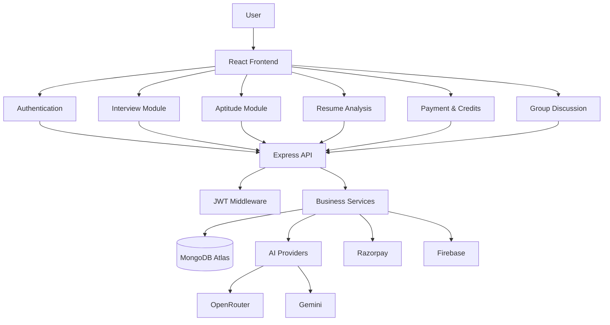

# INTELLIVORA

> AI-Powered Interview & Aptitude Preparation Platform

## Overview

INTELLIVORA is a full-stack AI-powered preparation platform designed to help
candidates practice interviews, evaluate their performance, improve weak areas,
and prepare for aptitude assessments through personalized learning workflows.

---

## ✨ Key Features

### 🤖 AI Interview Preparation
- Resume-based interview preparation
- Role and experience-based interview generation
- AI-powered response evaluation
- Structured feedback and scoring
- Interview performance reports
- Interview history

### 🧠 Aptitude Preparation
- Topic-based aptitude preparation
- Configurable aptitude tests
- Questions across multiple aptitude categories
- Timer-based test experience
- Automatic scoring
- Detailed result analysis
- Progress tracking
- Attempt history
- AI-assisted question generation

### 📄 Resume Analysis
- PDF resume upload
- Resume text extraction
- Resume analysis
- ATS-oriented evaluation
- Interview-readiness insights

### 🔐 Authentication & Security
- Firebase Google Authentication
- Server-side Firebase ID token verification
- JWT authentication
- HTTP-only cookies
- Protected API routes
- Server-side email allowlist enforcement
- Rate limiting on auth, payment, and AI endpoints
- Security headers (HSTS, X-Content-Type-Options, X-Frame-Options)
- Centralized error handling with production error masking

### 💳 Payments & Credits
- Credit-based usage system
- Razorpay integration
- Server-side payment verification
- Atomic credit deduction (race-condition safe)
- Razorpay webhook support
- Plan-based access

### 🗣️ Group Discussion (GD)
- AI-moderated group discussions
- Multiple AI participants with distinct personas
- Real-time speech-to-text input
- Turn-based discussion flow
- Post-session evaluation and scoring
- GD history and analysis

---

## 🏗️ System Architecture

---

## ⚙️ Environment Variables

### Server (`server/.env`)

| Variable | Description |
|---|---|
| `MONGO_URI` | MongoDB connection string |
| `JWT_SECRET` | Secret for signing JWT tokens |
| `OPENROUTER_API_KEY` | OpenRouter API key for AI models |
| `GEMINI_API_KEY` | Google Gemini API key |
| `RAZORPAY_KEY_ID` | Razorpay key ID |
| `RAZORPAY_KEY_SECRET` | Razorpay key secret |
| `RAZORPAY_WEBHOOK_SECRET` | Razorpay webhook signature secret |
| `FIREBASE_PROJECT_ID` | Firebase project ID for token verification |
| `SERVER_ALLOWED_EMAILS` | Comma-separated email allowlist (optional) |
| `FRONTEND_URL` | Frontend origin for CORS |
| `NODE_ENV` | `development` or `production` |

### Client (`client/.env`)

| Variable | Description |
|---|---|
| `VITE_SERVER_URL` | Backend API base URL |
| `VITE_FIREBASE_*` | Firebase configuration keys |
| `VITE_RAZORPAY_KEY_ID` | Razorpay publishable key |
