<div align="center">

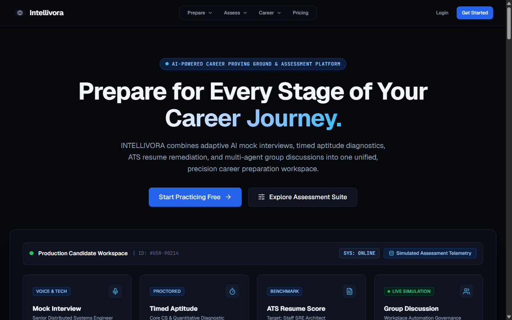

# Intellivora

### Interview, assessment, coding, and career-preparation workspaces


[Overview](#-overview) · [Quick start](#-quick-start) · [Features](#-features) · [Architecture](#-architecture) · [API](#-api-overview)

</div>

---

## 📚 Contents

- [Overview](#-overview)
- [Quick start](#-quick-start)
- [Features](#-features)
- [Showcase](#-showcase)
- [Technology stack](#-technology-stack)
- [Architecture](#-architecture)
- [Project structure](#-project-structure)
- [Scripts and testing](#-scripts-and-testing)
- [API overview](#-api-overview)
- [Authentication and authorization](#-authentication--authorization)
- [Security](#-security)

---

## 🔎 Overview

Intellivora is a web platform for practicing technical interviews, assessments,
coding and SQL exercises, group discussions, resume analysis, and career
preparation workflows.

The React/Vite client brings these workflows into one authenticated workspace.
The Express/Mongoose server handles authentication, validation, domain services,
persistence, AI integrations, payments, and administrative operations.

### At a glance

| Area | Included |
| --- | --- |
| Practice modules | Interview, Aptitude, Group Discussion, DSA, Quiz, SQL, and System Design |
| Career workflows | Resume analysis, JD Analyzer, Career Roadmap, Company Preparation, and Job Tracker |
| Assessment workflows | Mock Placement, interview reports, aptitude results, and Group Discussion analysis |
| Operations | Mistake Bank, credits, Razorpay payments, unified history, progress analytics, and admin pages |
| Server route groups | 19 mounted groups: health plus 18 `/api` route prefixes |

<details>
<summary><strong>How it works</strong></summary>

1. A visitor opens the Home page or `/auth`.
2. Firebase handles Google or phone sign-in.
3. The client hydrates the account through `GET /api/user/current-user`.
4. `ProtectedRoute` allows authenticated users into preparation, assessment,
   profile, career, and credit workflows.
5. The client sends requests through the shared Axios API client.
6. Express applies CORS, security headers, rate limiting, authentication,
   authorization, and configured Zod validation.
7. Controllers call domain services and Mongoose models, with external calls to
   Firebase, Gemini/OpenRouter, Razorpay, or MongoDB where required.
8. The client renders the relevant workspace, result, report, progress, or
   history view.

</details>

<p align="right"><a href="#intellivora">Back to top</a></p>

---

## 📦 Quick start

### Prerequisites

You need Node.js and npm, a MongoDB connection configured through
`MONGODB_URL`, a Firebase project, a Gemini and/or OpenRouter API key, and
Razorpay keys if you use payment flows.

### Install

From the repository root:

```bash
npm --prefix client install
npm --prefix server install
```

### Environment files

Both `client/.env.example` and `server/.env.example` exist.

**macOS, Linux, or Git Bash**

```bash
cp client/.env.example client/.env
cp server/.env.example server/.env
```

**Windows Command Prompt**

```bat
copy client\.env.example client\.env
copy server\.env.example server\.env
```

<details>
<summary>Environment variables</summary>

| Variable | Used in | Purpose |
| --- | --- | --- |
| `VITE_SERVER_URL` | Client API client, `App.jsx` | Server API origin |
| `VITE_FIREBASE_APIKEY` | Client Firebase config | Firebase client configuration |
| `VITE_FIREBASE_AUTH_DOMAIN` | Client Firebase config | Firebase client configuration |
| `VITE_FIREBASE_PROJECT_ID` | Client Firebase config | Firebase client configuration |
| `VITE_FIREBASE_STORAGE_BUCKET` | Client Firebase config | Firebase client configuration |
| `VITE_FIREBASE_MESSAGING_SENDER_ID` | Client Firebase config | Firebase client configuration |
| `VITE_FIREBASE_APP_ID` | Client Firebase config | Firebase client configuration |
| `VITE_RAZORPAY_KEY_ID` | Client payment UI | Razorpay client checkout key |
| `VITE_ADMIN_EMAIL` | `AdminProtectedRoute` | Client-side admin route check |
| `PORT` | `server/index.js` | Express listening port |
| `NODE_ENV` | Server middleware and auth services | Runtime environment |
| `CLIENT_URL` | `server/index.js` | Additional allowed CORS origin |
| `MONGODB_URL` | Database connection config | MongoDB connection string |
| `JWT_SECRET` | Auth controller and `isAuth` | JWT signing and verification secret |
| `OPENROUTER_API_KEY` | OpenRouter service | OpenRouter credential |
| `OPENROUTER_FREE_MODELS` | OpenRouter service | Optional comma-separated model list |
| `GEMINI_API_KEY` | Gemini service | Gemini credential |
| `GEMINI_MODEL` | Gemini and AI task profiles | Default Gemini model |
| `GEMINI_FAST_MODEL` | AI task profiles | Fast-task Gemini model |
| `GEMINI_EVAL_MODEL` | AI task profiles | Evaluation-task Gemini model |
| `RAZORPAY_KEY_ID` | Razorpay service | Razorpay server key |
| `RAZORPAY_KEY_SECRET` | Razorpay service | Razorpay server secret |
| `RAZORPAY_WEBHOOK_SECRET` | Payment controller | Webhook verification secret |
| `ADMIN_EMAIL` | `isAdmin` middleware | Server-side admin authorization email |
| `FIREBASE_PROJECT_ID` | Firebase auth service | Optional token audience check |
| `GD_CREDIT_COST` | Credits config | Optional Group Discussion credit cost |

</details>

### Run locally

Run in two terminals from the repository root.

**Terminal 1 — client**

```bash
npm --prefix client run dev
```

**Terminal 2 — server**

```bash
npm --prefix server run dev
```

Example URLs:

- Client: `http://localhost:5173`
- Server: `http://localhost:8000`

<p align="right"><a href="#intellivora">Back to top</a></p>

---

## 🧩 Features

<table>
<tr>
<td width="33%" valign="top">

### 🎤 Interview

Generate questions, submit answers, finish interviews, upload a resume for
interview preparation, and review reports, history, and replay sessions.

`/interview` · `/history` · `/report/:id`

<details>
<summary>Details</summary>

Interview requests include question generation, interview creation, answer
submission, completion, report retrieval, listing, lookup, and deletion.
Interview routes use the AI rate limiter and require authentication.

</details>

</td>
<td width="33%" valign="top">

### ⏰ Aptitude

Browse categories and topics, configure a test, save answers, recover an active
attempt, submit it, and review results and progress.

`/aptitude`

<details>
<summary>Details</summary>

The server supports categories, topics, progress, attempt creation, answer
saving, active-attempt lookup, attempt listing, results, and deletion.

</details>

</td>
<td width="33%" valign="top">

### 💬 Group Discussion

Move from overview and setup into a lobby and live room, then complete or abort
a session and review its analysis.

`/gd` · `/gd/setup` · `/gd/room/:id`

<details>
<summary>Details</summary>

The Group Discussion API supports overview, session creation, lobby readiness,
turn submission, completion, abortion, and session lookup. All routes require
authentication and use the AI rate limiter.

</details>

</td>
</tr>
<tr>
<td width="33%" valign="top">

### 💻 DSA

Browse problems, run sample code, submit code, request AI hints, review
submission history, and track coding progress.

`/prepare/dsa` · `/prepare/dsa/:slug`

<details>
<summary>Details</summary>

The server also exposes prototype code execution and supported-language lookup.
DSA workspace requests are authenticated and validated where configured.

</details>

</td>
<td width="33%" valign="top">

### 📝 Quiz

Browse quiz categories, start a quiz, submit it, open its result, and review
quiz history.

`/prepare/quiz` · `/prepare/quiz/screen/:attemptId`

<details>
<summary>Details</summary>

Quiz routes include category lookup, start, submit, history, and result
retrieval. Start and submit requests use request validation.

</details>

</td>
<td width="33%" valign="top">

### 💽 SQL

Browse SQL problems, open a problem workspace, and execute SQL.

`/prepare/sql` · `/prepare/sql/:slug`

<details>
<summary>Details</summary>

SQL problem browsing and lookup are public route operations; SQL execution
requires authentication and request validation.

</details>

</td>
</tr>
<tr>
<td width="33%" valign="top">

### 🧱 System Design

Browse system-design problems, open a workspace, save drafts, view attempts,
and submit an evaluation.

`/prepare/system-design` · `/prepare/system-design/:slug`

<details>
<summary>Details</summary>

The server provides problem listing, problem lookup, authenticated attempt
lookup, draft saving, and authenticated evaluation.

</details>

</td>
<td width="33%" valign="top">

### 📄 Resume & ATS

Upload a resume PDF, extract its text, and analyze it for the resume workflow
and interview preparation.

`/resume`

<details>
<summary>Details</summary>

Resume upload uses file handling and PDF validation middleware. The API exposes
upload, extraction, and analysis operations.

</details>

</td>
<td width="33%" valign="top">

### 🧭 Career tools

Analyze a job description, generate a Career Roadmap, update milestones, view
Company Preparation, and manage applications in the Job Tracker.

`/career/jd-analyzer` · `/career/roadmap` · `/career/job-tracker`

<details>
<summary>Details</summary>

Career routes cover JD analysis, roadmap read/generation, milestone updates,
job listing/creation/update/deletion, target companies, and company preparation.

</details>

</td>
</tr>
<tr>
<td width="33%" valign="top">

### 🚀 Mock Placement

Start a placement drive, return session state, submit rounds, list placement
history, and review a placement report.

`/assess/placement`

<details>
<summary>Details</summary>

The client provides setup, chamber, and report pages. The server validates
placement start, session parameters, and round submissions.

</details>

</td>
<td width="33%" valign="top">

### 🧠 Mistake Bank

Collect mistakes across preparation modules, filter them, revise notes, update
status, and track module statistics.

`/prepare/mistakes`

<details>
<summary>Details</summary>

Sources are `quiz`, `aptitude`, `dsa`, `sql`, `interview`, `system_design`,
and `manual`. Statuses are `unresolved`, `reviewing`, and `mastered`.
Re-recording the same question in the same module increments `attemptCount`;
re-recording a mastered mistake returns it to `unresolved`.

</details>

</td>
<td width="33%" valign="top">

### 💳 Credits & Payments

View credit history and use Razorpay order, verification, and webhook flows.

`/credits` · `/pricing`

<details>
<summary>Details</summary>

Order creation and payment verification require authentication. The webhook is
public and uses the payment rate limiter. Group Discussion credit cost can be
configured with `GD_CREDIT_COST`.

</details>

</td>
</tr>
<tr>
<td width="33%" valign="top">

### 🔧 Admin

Review users, analytics, newsletter subscribers, interviews, aptitude attempts,
Group Discussion sessions, resume analyses, and payments.

`/admin`

<details>
<summary>Details</summary>

The client includes 13 administrative pages, including list and detail views.
Server admin routes apply both `isAuth` and `isAdmin`; the configured admin
email is `ADMIN_EMAIL` on the server and `VITE_ADMIN_EMAIL` on the client.

</details>

</td>
<td width="33%" valign="top">

### 👤 Profile & history

Manage profile data, review unified history, and follow progress analytics across
the platform.

`/profile` · `/history` · `/progress`

<details>
<summary>Details</summary>

The user API provides current-user hydration, profile reads and updates,
profile lookup by ID, and credit transaction history. The history API provides
unified history, progress analytics, and history-item deletion.

</details>

</td>
<td width="33%" valign="top">

### 🔐 Authentication

Sign in with Google or phone authentication through Firebase and continue with
an application JWT session.

`/auth`

<details>
<summary>Details</summary>

The client observes Firebase auth state. The server verifies Firebase ID tokens,
then `isAuth` checks the JWT from the `token` HttpOnly cookie or an
Authorization Bearer header.

</details>

</td>
</tr>
</table>

<p align="right"><a href="#intellivora">Back to top</a></p>

---

## 📸 Showcase

### Interview and assessment

<table>
<tr>
<td width="50%" valign="top">
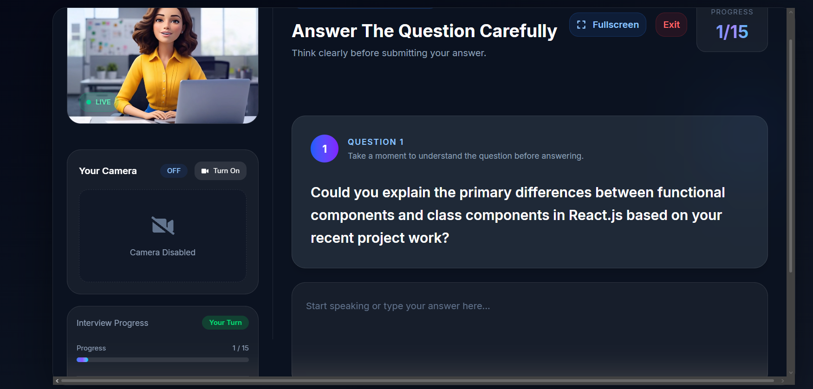
<p align="center"><sub>Interview workspace</sub></p>
</td>
<td width="50%" valign="top">
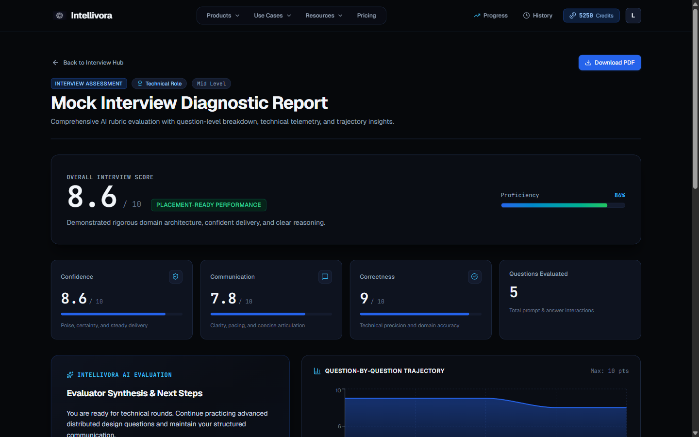
<p align="center"><sub>Interview scorecard</sub></p>
</td>
</tr>
<tr>
<td width="50%" valign="top">
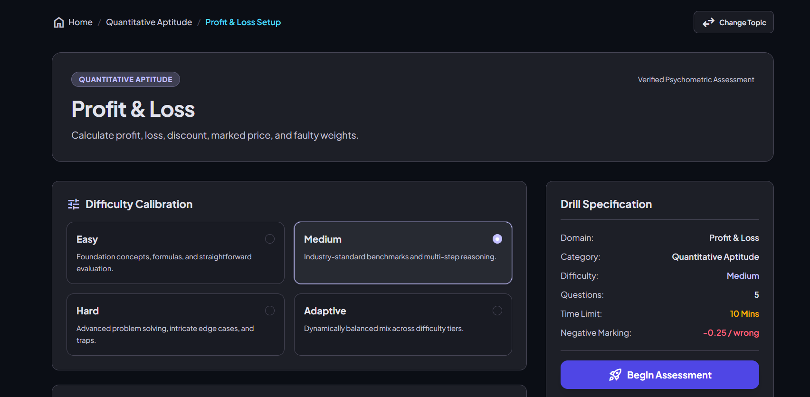
<p align="center"><sub>Aptitude assessment</sub></p>
</td>
<td width="50%" valign="top">
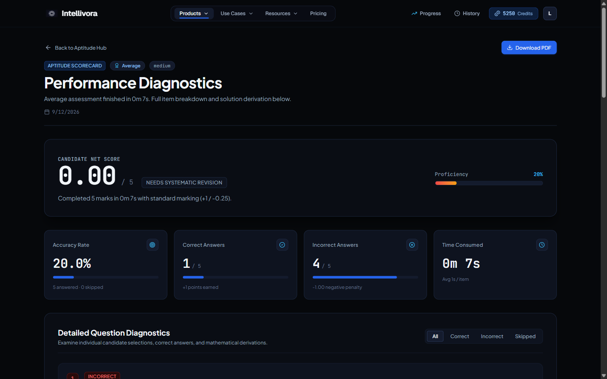
<p align="center"><sub>Aptitude solution review</sub></p>
</td>
</tr>
</table>

### Group Discussion and progress

<table>
<tr>
<td width="50%" valign="top">
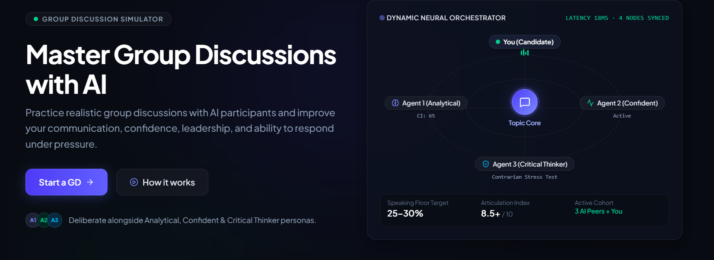
<p align="center"><sub>Group Discussion room</sub></p>
</td>
<td width="50%" valign="top">
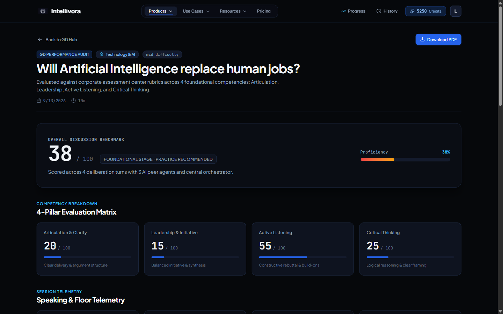
<p align="center"><sub>Group Discussion debrief</sub></p>
</td>
</tr>
<tr>
<td width="50%" valign="top">
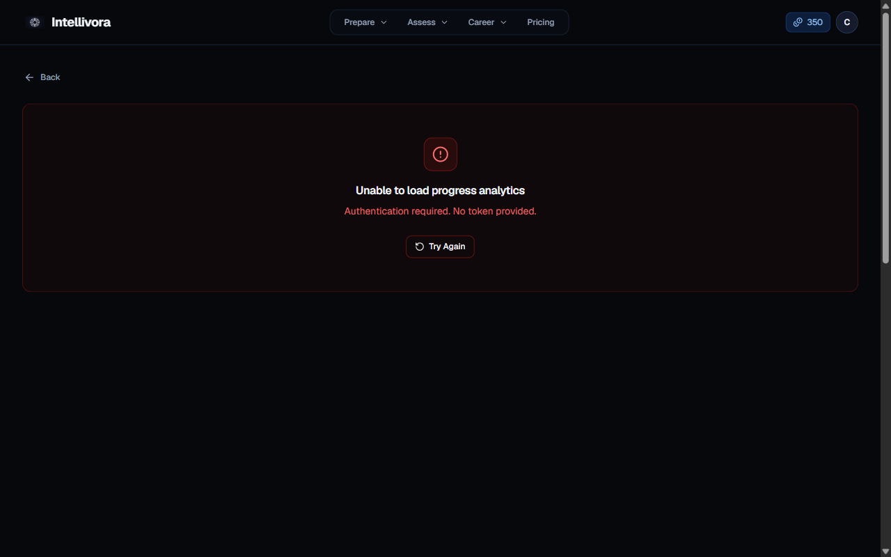
<p align="center"><sub>Progress analytics</sub></p>
</td>
<td width="50%" valign="top">
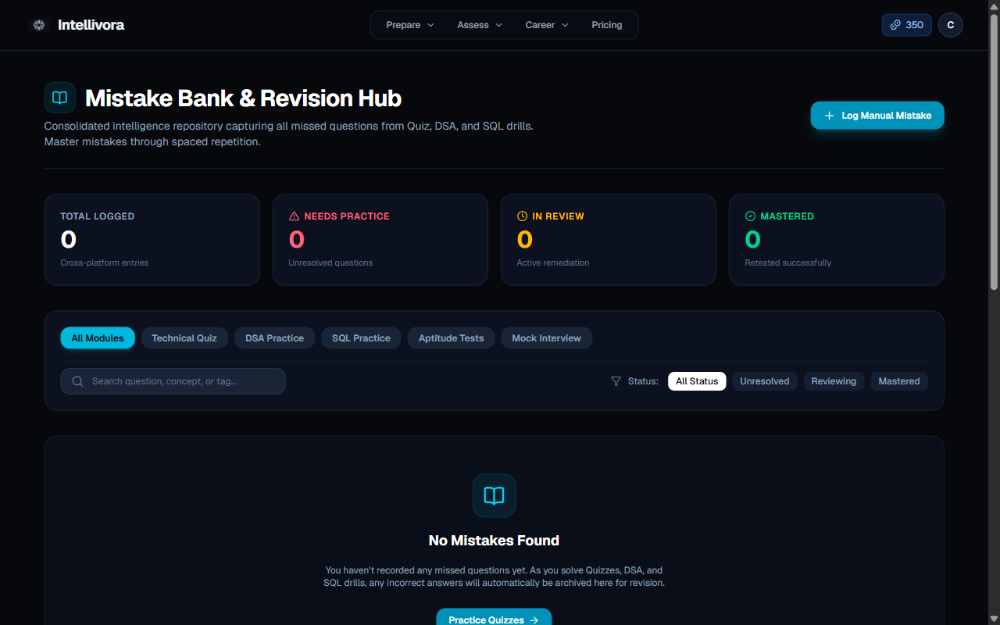
<p align="center"><sub>Mistake Bank</sub></p>
</td>
</tr>
</table>

### Preparation and operations

<table>
<tr>
<td width="50%" valign="top">
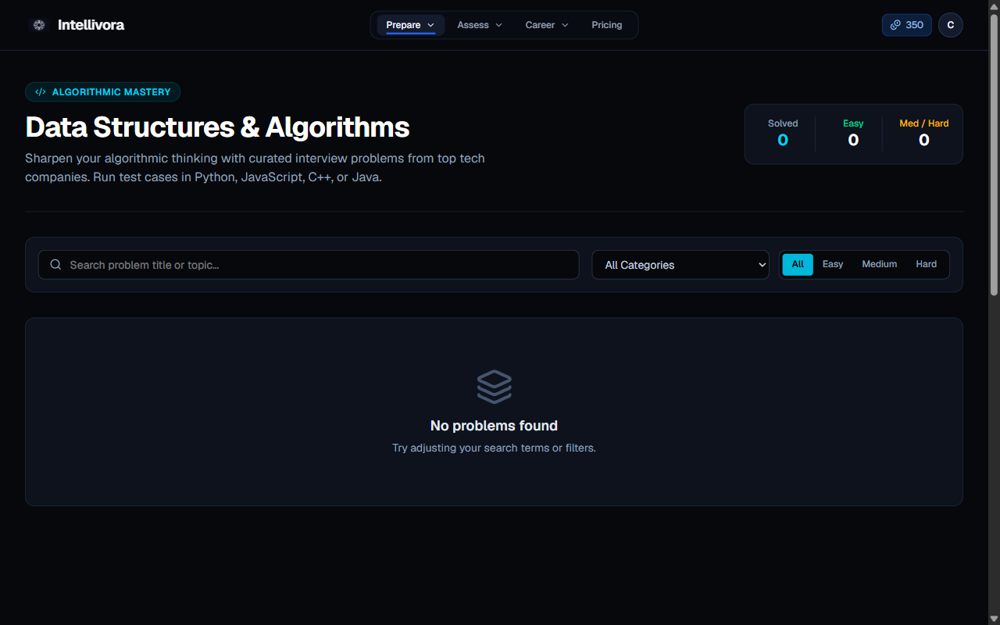
<p align="center"><sub>DSA catalog</sub></p>
</td>
<td width="50%" valign="top">
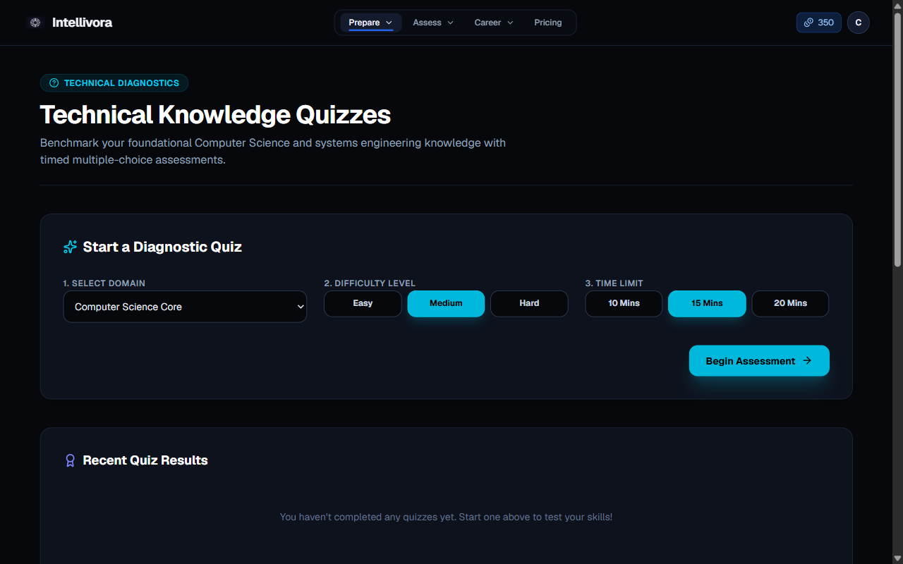
<p align="center"><sub>Quiz catalog</sub></p>
</td>
</tr>
<tr>
<td width="50%" valign="top">
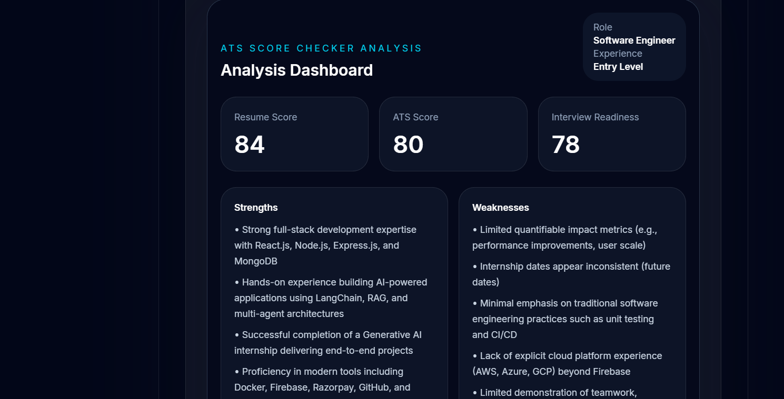
<p align="center"><sub>ATS resume score</sub></p>
</td>
<td width="50%" valign="top">
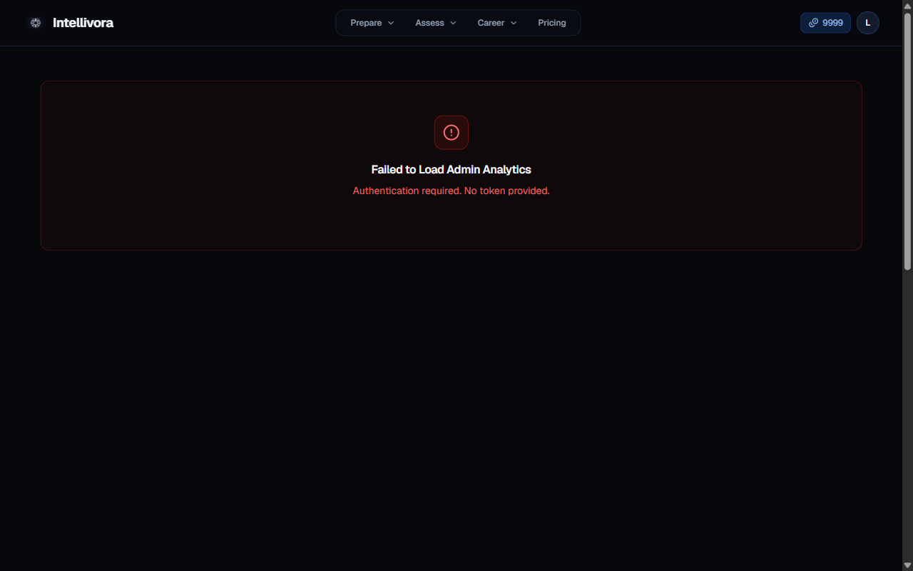
<p align="center"><sub>Admin operations hub</sub></p>
</td>
</tr>
</table>

### Home and account

<table>
<tr>
<td width="50%" valign="top">
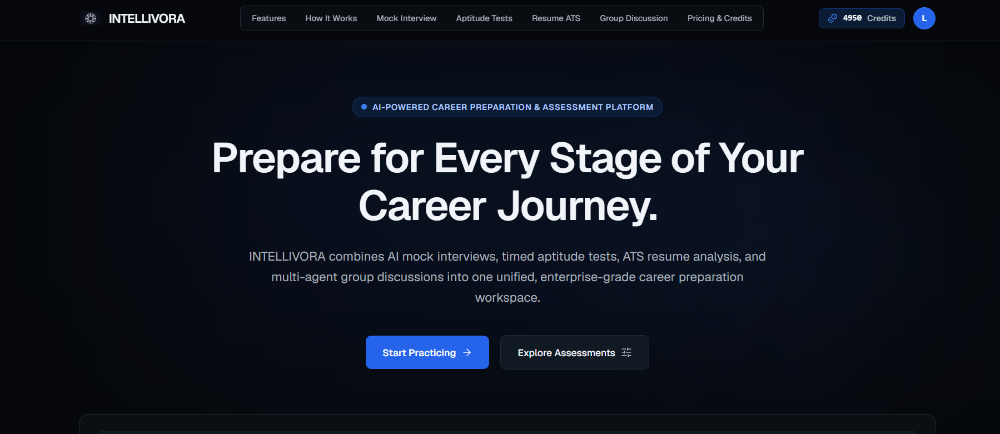
<p align="center"><sub>Home page</sub></p>
</td>
<td width="50%" valign="top">
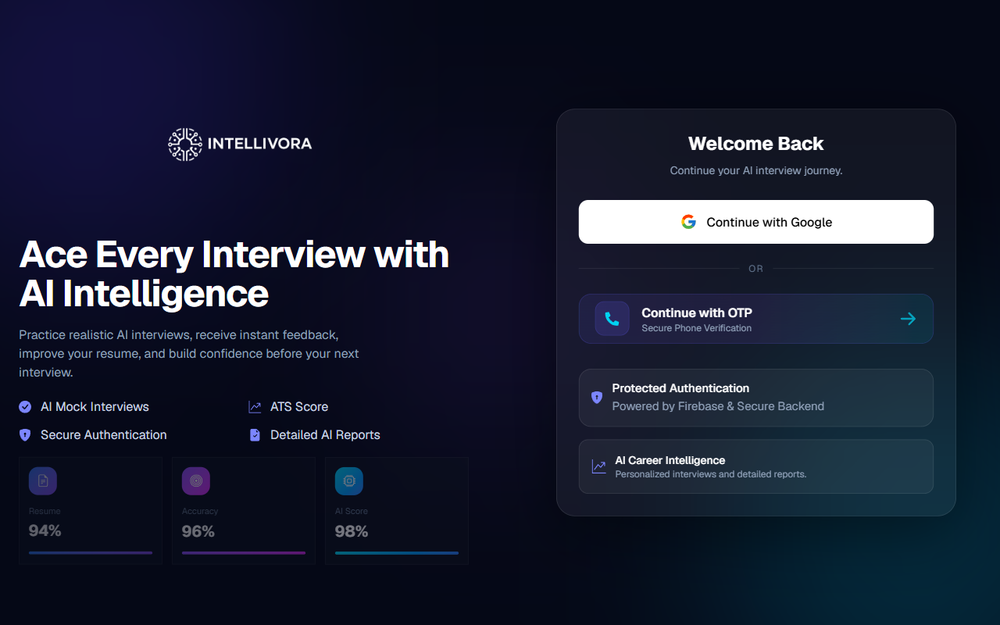
<p align="center"><sub>Authentication</sub></p>
</td>
</tr>
<tr>
<td width="50%" valign="top">
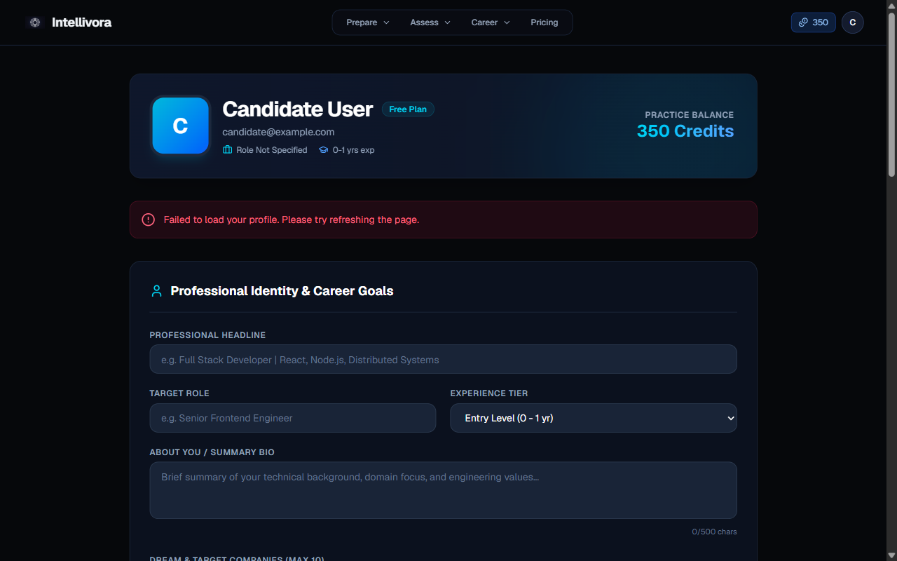
<p align="center"><sub>Candidate profile</sub></p>
</td>
<td width="50%" valign="top">
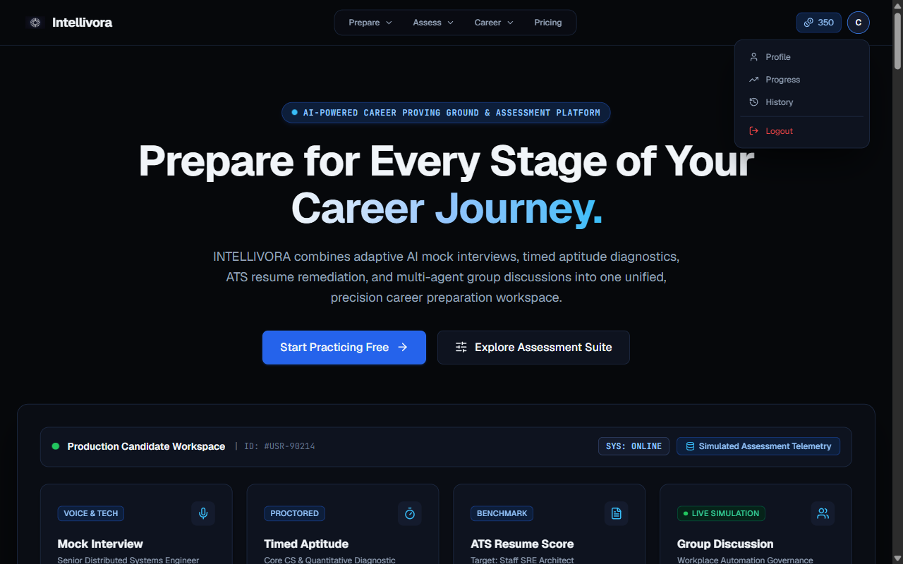
<p align="center"><sub>Profile dropdown</sub></p>
</td>
</tr>
</table>

<p align="right"><a href="#intellivora">Back to top</a></p>

---

## 🧰 Technology stack

**Frontend**


**Backend**


**Data**


**Auth**


**AI**


**Payments**


The client also uses Lucide React, React Icons, React Circular Progressbar,
jsPDF, jsPDF AutoTable, Sonner, and Tailwind CSS's Vite plugin.

<p align="right"><a href="#intellivora">Back to top</a></p>

---

## 🏛 Architecture

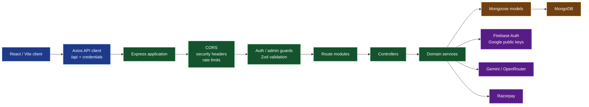
```mermaid
flowchart LR
    Browser["React / Vite client"]
    API["Axios API client<br/>/api + credentials"]
    Express["Express application"]
    Middleware["CORS<br/>security headers<br/>rate limits"]
    Guards["Auth / admin guards<br/>Zod validation"]
    Routes["Route modules"]
    Controllers["Controllers"]
    Services["Domain services"]
    Models["Mongoose models"]
    Mongo["MongoDB"]
    Firebase["Firebase Auth<br/>Google public keys"]
    AI["Gemini / OpenRouter"]
    Razorpay["Razorpay"]

    Browser --> API --> Express
    Express --> Middleware --> Guards --> Routes
    Routes --> Controllers --> Services --> Models --> Mongo
    Services --> Firebase
    Services --> AI
    Services --> Razorpay

    classDef client fill:#1e3a8a,stroke:#93c5fd,color:#fff
    classDef server fill:#14532d,stroke:#86efac,color:#fff
    classDef data fill:#713f12,stroke:#fde68a,color:#fff
    classDef external fill:#581c87,stroke:#d8b4fe,color:#fff

    class Browser,API client
    class Express,Middleware,Guards,Routes,Controllers,Services server
    class Models,Mongo data
    class Firebase,AI,Razorpay external
```

The client and server are separate packages. Express mounts the route modules,
applies middleware before routes, and connects services to Mongoose models and
external integrations. The shared Axios client sends credentials with API
requests.

## 📁 Project structure

<details>
<summary>Annotated repository tree</summary>

```text
.
├── client/
│   ├── public/                 Static client assets
│   ├── src/
│   │   ├── admin/              Administrative pages and APIs
│   │   ├── aptitude/           Aptitude workflow pages and components
│   │   ├── components/         Layout, guards, and shared components
│   │   ├── gd/                 Group Discussion workflow
│   │   ├── pages/              Public, protected, preparation, career, and profile pages
│   │   ├── redux/              Redux store and user slice
│   │   ├── services/           Client API modules
│   │   └── utils/              Firebase and client utilities
│   └── tests/                  Client test files
├── server/
│   ├── Routes/                 Express route modules
│   ├── config/                 Database and domain configuration
│   ├── controllers/            Request handlers
│   ├── middlewares/            Auth, admin, validation, upload, and hardening
│   ├── models/                 Mongoose models
│   ├── services/               AI, payment, profile, analysis, and execution services
│   ├── tests/                  Server test files
│   ├── utils/                  Server utilities
│   └── validators/              Zod request schemas
└── docs/
    └── screenshots/            Existing UI screenshots used above
```

</details>

---

## 🧪 Scripts and testing

### Client

| Command | Purpose |
| --- | --- |
| `npm run dev` | Start the Vite development server |
| `npm run build` | Build the client |
| `npm run lint` | Run Oxlint |
| `npm run preview` | Preview the client build |

### Server

| Command | Purpose |
| --- | --- |
| `npm start` | Start `node index.js` |
| `npm run dev` | Start `nodemon index.js` |

Test files are present under `client/tests/` and `server/tests/`. Neither
package declares an npm test script or a test-runner script. The configured
client checks are:

```bash
cd client
npm run lint
npm run build
```

The example configuration uses `http://localhost:5173` for the client and
`http://localhost:8000` for the server. The database readiness endpoint is
`http://localhost:8000/health` with the example server port.

---

## 🔌 API overview

The server mounts the following route groups:

| Group | Base path | Auth | Covers |
| --- | --- | --- | --- |
| Health | `/health` | None | Database readiness |
| Auth | `/api/auth` | Firebase credential | Google/phone auth and logout |
| User | `/api/user` | Required | Current user, profile, and credits |
| Interview | `/api/interview` | Required | Questions, answers, reports, and history |
| Resume | `/api/resume` | Required | Upload, extraction, and analysis |
| Aptitude | `/api/aptitude` | Required | Categories, attempts, answers, and results |
| Group Discussion | `/api/gd` | Required | Session lifecycle and analysis |
| History | `/api/history` | Required | Unified history and progress |
| Payment | `/api/payment` | Mixed | Orders, verification, and webhooks |
| Admin | `/api/admin` | Admin | Users, analytics, records, newsletter, and payments |
| Newsletter | `/api/newsletter` | None | Newsletter subscription |
| DSA | `/api/dsa` | Required | Problems, execution, hints, submissions, and progress |
| Questions | `/api/questions` | Mixed | Question categories and questions |
| Quizzes | `/api/quizzes` | Mixed | Categories, attempts, results, and history |
| SQL | `/api/sql` | Mixed | Problems and execution |
| System Design | `/api/system-design` | Mixed | Problems, drafts, attempts, and evaluation |
| Mistake Bank | `/api/mistakes` | Required | Records, statuses, notes, and statistics |
| Career | `/api/career` | Mixed | JD analysis, roadmap, companies, and jobs |
| Placement | `/api/placement` | Required | Placement sessions, rounds, history, and reports |

<p><sub>Legend: <strong>Required</strong> uses <code>isAuth</code>; <strong>Admin</strong> uses <code>isAuth</code> and <code>isAdmin</code>; <strong>Mixed</strong> contains both public and authenticated routes.</sub></p>

<details>
<summary><strong>Authentication, user, interview, resume, and assessment endpoints</strong></summary>

| Method | Endpoint | Auth | Purpose |
| --- | --- | --- | --- |
| `POST` | `/api/auth/google` | Firebase credential | Google authentication |
| `POST` | `/api/auth/phone` | Firebase credential | Phone authentication |
| `GET`, `POST` | `/api/auth/logout` | None | Logout |
| `GET` | `/api/user/current-user` | Required | Current user |
| `GET` | `/api/user/profile` | Required | Current profile |
| `PUT` | `/api/user/profile` | Required + validation | Update profile |
| `GET` | `/api/user/profile/:userId` | Required + validation | Read profile by ID |
| `GET` | `/api/user/credits/transactions` | Required + validation | Credit transactions |
| `POST` | `/api/interview/resume` | Required + upload | Resume-assisted interview analysis |
| `POST` | `/api/interview/generate-questions` | Required | Generate questions |
| `POST` | `/api/interview/create-interview` | Required | Create interview |
| `POST` | `/api/interview/submit-answer` | Required | Submit answer |
| `POST` | `/api/interview/finish` | Required | Finish interview |
| `GET` | `/api/interview/get-interviews` | Required | List interviews |
| `GET` | `/api/interview/report/:id` | Required | Interview report |
| `GET` | `/api/interview/:id` | Required | Interview by ID |
| `DELETE` | `/api/interview/delete-interview/:id` | Required | Delete interview |
| `POST` | `/api/resume/upload` | Required + upload | Upload resume PDF |
| `POST` | `/api/resume/extract` | Required | Extract resume text |
| `POST` | `/api/resume/analyze` | Required | Analyze resume |
| `GET` | `/api/aptitude/categories` | Required | List aptitude categories |
| `GET` | `/api/aptitude/categories/:category/topics` | Required | List category topics |
| `GET` | `/api/aptitude/progress` | Required | Aptitude progress |
| `POST` | `/api/aptitude/attempts` | Required | Start attempt |
| `POST`, `PATCH` | `/api/aptitude/attempts/:id/answers` | Required | Save answer |
| `POST`, `PATCH` | `/api/aptitude/attempts/:id/save-answer` | Required | Save answer alias |
| `POST` | `/api/aptitude/attempts/:id/submit` | Required | Submit attempt |
| `GET` | `/api/aptitude/attempts` | Required | List attempts |
| `GET` | `/api/aptitude/attempts/active` | Required | Active attempt |
| `GET` | `/api/aptitude/attempts/:id` | Required | Attempt by ID |
| `GET` | `/api/aptitude/attempts/:id/result` | Required | Attempt result |
| `DELETE` | `/api/aptitude/attempts/:id` | Required | Delete attempt |
| `GET` | `/api/history/`, `/api/history/unified` | Required | Unified history |
| `GET` | `/api/history/progress` | Required | Progress analytics |
| `DELETE` | `/api/history/:type/:id` | Required | Delete history item |

</details>

<details>
<summary><strong>Group Discussion, preparation, career, and placement endpoints</strong></summary>

| Method | Endpoint | Auth | Purpose |
| --- | --- | --- | --- |
| `GET` | `/api/gd/overview` | Required | Group Discussion overview |
| `POST` | `/api/gd/session/create` | Required | Create session |
| `GET` | `/api/gd/session/:id` | Required | Get session |
| `POST` | `/api/gd/session/:id/lobby-ready` | Required | Mark lobby ready |
| `POST` | `/api/gd/session/:id/turn` | Required | Submit turn |
| `POST` | `/api/gd/session/:id/complete` | Required | Complete session |
| `POST` | `/api/gd/session/:id/abort` | Required | Abort session |
| `GET` | `/api/dsa/problems/:slug` | Required | DSA problem |
| `POST` | `/api/dsa/problems/:slug/run` | Required + validation | Run sample code |
| `POST` | `/api/dsa/problems/:slug/submit` | Required + validation | Submit code |
| `POST` | `/api/dsa/problems/:slug/hint` | Required + validation | Get AI hint |
| `GET` | `/api/dsa/history/:slug` | Required + validation | Submission history |
| `GET` | `/api/dsa/progress` | Required | Coding progress |
| `GET` | `/api/questions/categories` | None | Question categories |
| `GET` | `/api/questions` | Validation | Question list |
| `GET` | `/api/questions/:slug` | Validation | Question by slug |
| `GET` | `/api/quizzes/categories` | None | Quiz categories |
| `POST` | `/api/quizzes/start` | Required + validation | Start quiz |
| `POST` | `/api/quizzes/:id/submit` | Required + validation | Submit quiz |
| `GET` | `/api/quizzes/history` | Required | Quiz history |
| `GET` | `/api/quizzes/:id` | Required | Quiz result |
| `GET` | `/api/sql/problems` | None | SQL problems |
| `GET` | `/api/sql/:slug` | Validation | SQL problem |
| `POST` | `/api/sql/:slug/execute` | Required + validation | Execute SQL |
| `GET` | `/api/system-design/problems` | None | System Design problems |
| `GET` | `/api/system-design/:slug` | Validation | System Design problem |
| `GET` | `/api/system-design/:slug/attempt` | Required + validation | Get attempt |
| `PUT` | `/api/system-design/:slug/draft` | Required + validation | Save draft |
| `POST` | `/api/system-design/:slug/evaluate` | Required + validation | Evaluate submission |
| `GET` | `/api/mistakes` | Required + validation | Filter mistakes |
| `POST` | `/api/mistakes` | Required + validation | Record mistake |
| `GET` | `/api/mistakes/stats` | Required | Mistake statistics |
| `PATCH` | `/api/mistakes/:id/status` | Required + validation | Update status |
| `PATCH` | `/api/mistakes/:id/notes` | Required + validation | Update notes |
| `DELETE` | `/api/mistakes/:id` | Required + validation | Delete mistake |
| `POST` | `/api/career/analyze-jd` | Required + validation | Analyze JD |
| `GET`, `POST` | `/api/career/roadmap` | Required | Read or generate roadmap |
| `PATCH` | `/api/career/roadmap/milestone` | Required + validation | Update milestone |
| `GET`, `POST` | `/api/career/jobs` | Required | List or create job |
| `PATCH`, `DELETE` | `/api/career/jobs/:id` | Required | Update or delete job |
| `GET` | `/api/career/companies` | None | Target companies |
| `GET` | `/api/career/companies/:company` | None | Company preparation |
| `GET` | `/api/placement/history` | Required | Placement history |
| `POST` | `/api/placement/start` | Required + validation | Start placement |
| `GET` | `/api/placement/:id` | Required + validation | Placement state |
| `POST` | `/api/placement/:id/round/:roundNum` | Required + validation | Submit round |
| `GET` | `/api/placement/:id/report` | Required + validation | Placement report |

</details>

<details>
<summary><strong>Payment, newsletter, and admin endpoints</strong></summary>

| Method | Endpoint | Auth | Purpose |
| --- | --- | --- | --- |
| `POST` | `/api/payment/order` | Required | Create Razorpay order |
| `POST` | `/api/payment/verify` | Required | Verify payment |
| `POST` | `/api/payment/webhook` | None | Razorpay webhook |
| `POST` | `/api/newsletter/subscribe` | None | Subscribe to newsletter |
| `GET` | `/api/admin/users` | Admin | List users |
| `PATCH` | `/api/admin/users/:id` | Admin | Update user |
| `PATCH` | `/api/admin/users/:id/credits` | Admin + validation | Update user credits |
| `GET` | `/api/admin/users/:id/credit-history` | Admin + validation | User credit history |
| `DELETE` | `/api/admin/users/:id` | Admin | Delete user |
| `GET`, `DELETE` | `/api/admin/interviews`, `/api/admin/interviews/:id` | Admin | Manage interviews |
| `GET`, `DELETE` | `/api/admin/aptitude`, `/api/admin/aptitude/:id` | Admin | Manage aptitude attempts |
| `GET`, `DELETE` | `/api/admin/gd`, `/api/admin/gd/:id` | Admin | Manage Group Discussion sessions |
| `GET`, `DELETE` | `/api/admin/resume`, `/api/admin/resume/:id` | Admin | Manage resume analyses |
| `GET` | `/api/admin/payments`, `/api/admin/payments/:id` | Admin | View payments |
| `GET`, `DELETE` | `/api/admin/newsletter`, `/api/admin/newsletter/:id` | Admin | Manage subscribers |
| `GET` | `/api/admin/analytics` | Admin | Admin analytics |

</details>

<p align="right"><a href="#intellivora">Back to top</a></p>

---

## 🔑 Authentication & authorization

1. Firebase initializes from the client `VITE_FIREBASE_*` configuration.
2. Google or phone sign-in produces a Firebase credential sent to the auth API.
3. The server verifies the Firebase ID token and establishes the application
   session.
4. The client requests `/api/user/current-user` and stores the returned user in
   Redux.
5. `ProtectedRoute` waits for auth hydration and redirects missing users to
   `/auth`.
6. `isAuth` reads the `token` cookie first, then a Bearer Authorization header,
   verifies the JWT, attaches `req.userId`, and checks account status.
7. `AdminProtectedRoute` compares the signed-in email with `VITE_ADMIN_EMAIL`.
8. `isAdmin` compares the authenticated user's email with `ADMIN_EMAIL` after
   `isAuth`.

## 🔒 Security

See [SECURITY.md](SECURITY.md) for the vulnerability reporting policy.

The server includes Firebase ID-token verification, JWT verification, banned and
deactivated account checks, server-side admin authorization, Zod request
validation, explicit credentialed CORS origins, response security headers,
production HSTS, and general, authentication, AI, payment, and newsletter rate
limiters.

<div align="center">

<sub>Built by [Lucky Gupta](https://github.com/lucky5111397) · [Portfolio](https://luckygupta.vercel.app)</sub>

</div>
